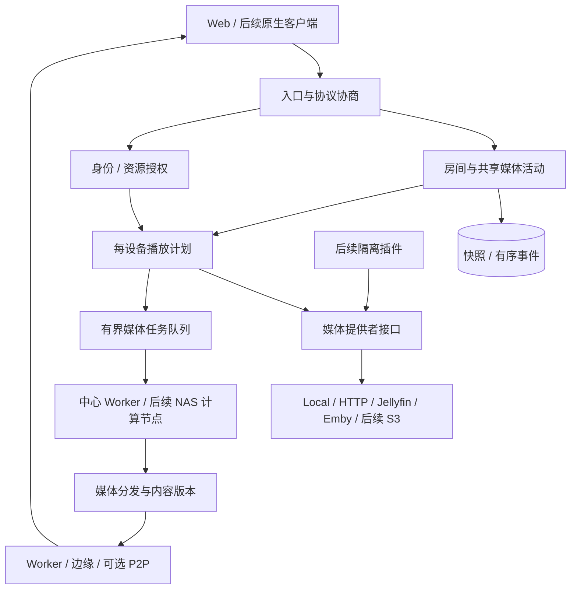

# RainSync 后续详细计划与工程细节

> 续接原《RainSync 工程架构与实施计划》第 1–5 章。编写日期：2026-09-27。
> 本文是待实施计划；“建议”“目标”“拟新增”均不代表功能已经交付。

## 6. 当前基线、优先级与剩余工作

### 6.1 从已有开发预览继续

原计划中“当前目录为空”是原始规划背景，不再描述当前状态。本次读取了 `C:\rainsync` 下的 README、STATUS、ACCEPTANCE、VALIDATION、初始迁移及核心代码；没有重新运行部署、媒体测试或长时间验收。

当前已存在 Server、Worker、Agent、Web，以及协议、房间状态机、媒体处理、片源和持久化模块。仓库记录了真实 PostgreSQL、HTTP/NAS、FFmpeg 和 Chromium 播放的验证，但真实 Jellyfin/Emby、移动实机、持续压测、72 小时运行和 arm64 验收仍有缺口。下文将这些记录视为历史证据，发布前需在候选版本重跑。

有两项文档与实现差异应在首轮整理：README 仍称 Agent 只支持直放，后续验证记录已包含远程转码；providers 目前在同一模块中处理 Jellyfin/Emby，原计划要求分别验证请求模型。前者修正文档，后者按真实契约逐步拆分，不重写已工作的全部适配层。

当前 Git 工作区有大量尚未提交文件。因此首个基线必须记录文件清单、源码摘要、依赖锁文件摘要和镜像摘要；仅填写 Git SHA 无法准确描述这次开发预览。

### 6.2 优先级和范围

| 级别 | 要解决的问题 | 处理原则 |
|---|---|---|
| P0 | 越权读取、错误时间轴、任务失控、旧任务覆盖新产物、恢复丢失必要密钥 | 发布前关闭，不能用免责声明替代修复 |
| P1 | 真实上游兼容、移动播放、弱网恢复、字幕音轨、容量与可运维性 | 原首版验收范围，必须形成证据 |
| P2 | 自建 ABR、硬件转码、HDR、ASS | v0.1 发布后按兼容矩阵实施 |
| P3 | 多地区边缘缓存、P2P、原生客户端、多实例 | 由测量结果和使用需求触发 |

v0.1 的完成条件是“承诺的播放路径可稳定使用，并能解释和恢复失败”。跨会话分片复用和请求合并属于后续优化，不因它们出现在 STATUS 的未完成清单就自动成为首版阻塞项；原第 5 章的真机、NAS 两小时、100 在线持续控制面、72 小时和恢复门槛仍保留。

### 6.3 剩余工作包

以下工期是单人全职净开发估算，包含对应自动测试和文档，不是实测进度；不包含等待设备、上游授权和跨地区环境的时间。

| 编号 | 工作包 | 主要落点 | 依赖 | 估算 |
|---|---|---|---|---|
| W01 | 固定基线、样本库、协议和错误契约 | docs、tests、crates/protocol | 无 | 4–6 人日 |
| W02 | 编解码能力、播放方案和失败降级 | player-core、media-core、server/media | W01 | 5–7 人日 |
| W03 | Jellyfin/Emby 真实契约与会话生命周期 | providers、server/upstream | W01；最终验收依赖 W02 | 4–6 人日 |
| W04 | HTTP/HLS 跳转授权、Range 与目录访问 | providers、Worker、Agent | W01 | 3–5 人日 |
| W05 | 任务执行代次、取消、原子产物、缓存保护 | Worker、persistence、migrations | W01 | 5–7 人日 |
| W06 | 时间轴、字幕、音轨与同步恢复闭环 | web、player-core、sync-engine | W02、W03、W05 | 4–6 人日 |
| W07 | Agent 故障矩阵、持续传输与配额 | Agent、Worker/relay、tests | W04、W05 | 4–6 人日 |
| W08 | 指标、弱网与持续 100 在线压测 | metrics、tests、deploy | W02–W07 | 4–6 人日 |
| W09 | Android/iOS 实机与 arm64 验收 | web、deploy、兼容台账 | W02、W06、W07 | 4–6 人日 |
| W10 | 升级、灾难恢复、72 小时与发布材料 | migrations、deploy、docs | W08、W09 | 3–5 人日 |

总量约 40–60 人日，即 8–12 个工作周；建议按 12 周安排剩余工作，另留 2 周故障返工缓冲。原 24 周是从零开始的总排期，本表是从当前预览继续的重新估算，两者不直接相加。第 2 周结束后用已完成工作量重估。

本轮分支补充增加 E01 生命周期与权限核查，首版预算修订见第 28.3 节：完整实施约 43–65 人日、9–13 工作周，另留两周缓冲。私人库、插件和多节点等扩展独立估算。

## 7. 接口、数据模型与模块边界

### 7.1 先稳定契约，再按变更拆文件

保留现有 workspace。处理某个工作包时再拆对应模块，避免先进行大规模目录重构：

| 现有入口 | 拟拆分职责 | 不变量 |
|---|---|---|
| `apps/server/src/media.rs` | 会话鉴权、播放计划选择、会话持久化 | 只由服务端签发可访问资源 |
| `crates/providers/src/lib.rs` | common、http、jellyfin、emby | 上游差异留在各自适配器 |
| `apps/media-worker/src/main.rs` | delivery、jobs、process、manifest | HTTP 处理不阻塞在完整媒体生成上 |
| `apps/web/src/App.vue` | 房间状态、播放器绑定、片源管理组件 | 播放器事件不会无意变成房主命令 |
| `packages/player-core/index.ts` | capability、timeline、adapter、recovery | 不依赖 Vue、不直接修改房间权威状态 |

`room-core` 保持纯状态计算；数据库事务由 persistence/房间服务负责；providers 不承担房间权限；Worker 不自行决定谁是房主。

### 7.2 补齐三种不同的代次

| 字段 | 改变时机 | 解决的问题 |
|---|---|---|
| `media_generation` | 房间切片源 | 旧影片的异步结果污染新影片 |
| `plan_generation`，拟新增 | 某观看者切音轨、降级、重建播放方案 | 同一影片的旧 URL、旧 ready 回调覆盖新会话 |
| `attempt`，拟新增 | 同一媒体任务重新领取执行 | 租约超时的旧 Worker 继续写入 |

三者不能互相替代。成员切字幕或音轨不增加房间 `revision`；如果房主发出 seek，则权威位置先更新，再由各成员按自己的方案追赶。

统一原片时间单位为毫秒；HTMLVideoElement 边界转换为秒，上游 ticks 的转换只在对应 adapter 中进行。所有时间值拒绝 NaN、无穷、负时长与越界位置；浮点精度误差通过明确容差处理。

### 7.3 统一错误与幂等

REST 错误和 WebSocket ERROR 使用同一错误模型：

```json
{
  "error": {
    "code": "PLAYBACK_CAPACITY_EXCEEDED",
    "message": "转码资源正忙，请稍后重试",
    "retryable": true,
    "retry_after_ms": 3000,
    "request_id": "opaque-id"
  }
}
```

`retry_after_ms` 仅在服务端有依据时返回。日志记录内部原因，响应不包含上游请求头、原始签名地址和宿主机绝对路径。

| HTTP | 代表错误 | 客户端行为 |
|---|---|---|
| 401 / 403 | 会话失效 / 权限不足 | 重新登录或退出房间，不无限重试 |
| 409 | 版本冲突、媒体或方案代次过期 | 取新快照，丢弃旧异步结果 |
| 416 | 合法但不可满足的字节区间 | 重新确认资源版本和长度 |
| 422 | 编码、DRM 或输出传输不支持 | 显示具体原因和可行替代路线 |
| 429 | 用户/房间请求配额 | 带抖动退避 |
| 502 / 504 | 上游失败 / 等待超时 | 有限重试；保留诊断 ID |
| 503 | Worker/Agent 容量不足 | 展示排队或稍后重试，不启动旁路任务 |

播放控制继续使用 `command_id`；相同 ID、不同用户或不同有效载荷必须拒绝，不能误返别人的成功结果。建议去重保留 48 小时，并用服务端签发、最长 24 小时的控制 epoch 限制旧命令重放；过期 epoch 只允许重新同步，不重新执行旧命令。房间事件保留 24 小时，去重结果的保留规则独立定义。

创建播放会话增加请求幂等键，绑定用户、房间、媒体代次和请求摘要；HTTP 超时重试不重复创建 FFmpeg。幂等记录至少覆盖会话有效期及重试窗口。客户端已知失败后的主动再次操作使用新键。

### 7.4 数据库迁移草案

当前只有 `0001_initial.sql`，后续新增迁移，禁止修改已部署初始迁移。以下是拟新增字段，不表示全部一次性引入。

| 对象 | 拟增字段/表 | 必要约束或索引 |
|---|---|---|
| media_items | `source_version`、`probe_version`、`probed_at` | 同资源内容变化后不可沿用旧探测 |
| playback_sessions | `plan_generation`、`last_seen_at`、`capability_hash` | 用户、房间、代次共同验证；状态查询有索引 |
| playback_requests | 用户、幂等键、请求摘要、会话 ID、过期时间 | `(user_id, idempotency_key)` 唯一 |
| media_jobs | `attempt`、`max_attempts`、`cancel_requested_at`、结构化错误 | 所有心跳/完成更新必须匹配 owner 与 attempt |
| media_outputs | job、attempt、版本、目录、状态、清单摘要 | 每次执行独立；仅当前执行可发布 |
| cache_entries | `state`、`reserved_bytes`、`expires_at` | 按状态、最近使用和到期时间清理 |
| cache_read_leases | cache key、reader、租期 | 活跃读取期间不删除；崩溃后可回收 |
| sources 配置 | 策略版本、允许域名/端口/网段、凭据作用域 | 加密配置内显式保存，不能由播放请求覆盖 |

文件版本先用来源提供的可靠版本标识；本地文件的大小和修改时间只作快速变化检测，不能当作安全内容摘要。跨会话复用时加入强版本或内容哈希；上游版本不可信时将复用限制在本次会话。

迁移采用“新增可空字段 → 双版本读取兼容 → 分批回填 → 添加约束”的顺序。大表索引变更评估锁时长；需要非事务建索引的迁移单独配置，不混入假定全事务的脚本。

## 8. 能力协商、播放方案与上游兼容

### 8.1 从三个布尔值扩展为具体能力

现有 `PlaybackCapabilities` 只有 progressive H.264/AAC、native HLS、MSE H.264/AAC 三项。它适合传输门控，但不能证明任意 H.264 profile、10-bit、4K 或多声道内容可解码。

建议新增版本化 `CapabilityReport`：

```text
schema_version
transports: progressive / native_hls / mse_hls
video_candidates[]: codec_string, width, height, framerate, bitrate,
                    supported, smooth?, power_efficient?, evidence
audio_candidates[]: codec_string, channels, sample_rate, supported
constraints: max_bitrate?, prefer_power_efficient, allow_transcode
```

服务端先根据媒体元数据给出有限候选，客户端测试这些具体组合，避免穷举所有编码。能力信号组合 `canPlayType`、MSE 类型检测及可用时的 `MediaCapabilities.decodingInfo()`；后者可返回 supported、smooth 和 powerEfficient，但仍需真实播放验证。[MDN 能力检测说明](https://developer.mozilla.org/en-US/docs/Web/API/MediaCapabilities/decodingInfo)

能力结果仅用于协商，不授予访问权限。持久化只保存必要结果和版本，避免收集不必要设备指纹。首版旧客户端缺少新字段时走保守兼容路线；破坏性协议变化再提升协议主版本。

### 8.2 可解释的路线选择

播放方案增加 `decision_reason`、`selected_audio_track`、`subtitle_mode`、`plan_generation`、`seekable_media_ranges_ms` 和可选 `pending_job_id`。

1. 验证用户、房间、片源和媒体代次。
2. 检查探测结果是否与当前资源版本一致；未知时先探测或返回准备状态。
3. 根据视频、音频、字幕、容器和传输分别判定，不能仅凭扩展名。
4. 依次尝试直放、转封装、仅音频转码、完整视频转码。
5. 检查目标客户端能否播放输出，以及 Worker 是否有容量。
6. 原子创建会话及任务引用，返回 preparing/queued/ready，而不是提前返回不可用清单。

首版不支持的 HDR 转 SDR、图形字幕或 DRM 返回明确错误。无音轨、可变帧率、旋转信息和非方形像素作为样本库必要边界项。

### 8.3 真实解码失败后的有限降级

每个观看者每次播放请求维护已尝试路线集合；同一路线最多一次。建议初值为全流程最多三种路线、每条路线首帧等待 20 秒，排队时间单独展示，具体数值由实测调整。

不能把 401、网络超时和解码失败都当作“需要转码”。解码失败可升级兼容路线；401 先恢复授权；网络不足时只切换确实存在的较低档，v0.1 单档 HLS 没有可切档位。

降级后保留原片时间坐标、音轨偏好和房间状态。用户取消、切片源或离房时立即取消整条重试链。使用 `AbortController`/取消令牌，并在每个异步完成回调核对 `plan_generation`。

### 8.4 Jellyfin 与 Emby 的独立契约

W03 为两种服务分别建立真实实例测试夹具。仓库提到 Jellyfin 10.11.0 是原验证起点，不是本次已确认兼容的版本；首次运行记录实际版本、镜像 digest、服务端配置和授权条件。Emby 同样先固定一个可运行版本，再扩展次版本兼容。

| 操作 | 请求必须覆盖 | 返回与行为必须验证 |
|---|---|---|
| 浏览 | 分页、库权限、电影/剧集、空库 | 不遗漏、不重复，失败不清空已索引库 |
| PlaybackInfo | DeviceProfile、起点、音轨、码率限制、传输限制 | 真实输出与申报能力一致 |
| 开始/进度 | 上游会话 ID、位置、暂停/seek 状态 | 按上游契约建立并更新会话 |
| 结束 | 用户停止、过期、切片源、浏览器离开 | 上游转码资源回收；失败进入有界重试 |
| 凭据失效 | 过期令牌、撤销账户、库权限变化 | 停止访问并给出明确错误 |

两个 API 均有播放协商模型，但具体字段、认证与行为以各自文档和固定版本实测为准。[Jellyfin PlaybackInfoDto](https://kotlin-sdk.jellyfin.org/dokka/jellyfin-model/org.jellyfin.sdk.model.api/-playback-info-dto/index.html)、[Emby PlaybackInfo](https://dev.emby.media/reference/RestAPI/MediaInfoService/postItemsByIdPlaybackinfo.html)

进度从已授权成员的播放状态取得，建议活跃时每 10 秒合并上报，暂停/seek/停止即时上报；错误重试加退避。每个观看者的上游会话独立关闭，不能因为甲离开而停止乙的转码。专用媒体账户的上游观看记录可能受这些上报影响，发布文档说明并使用专用账户。

完成证据至少包含：两种真实服务各自的浏览、直放、必要转码、三处随机 seek、切音轨、停止及令牌失效记录。模拟契约继续用于 CI，但不替代真实服务验收。

## 9. HTTP/HLS 与 NAS 传输细节

### 9.1 显式片源访问策略

当前实现保守拒绝跳转。扩展跨域 HLS/CDN 时新增管理员配置策略，而非开放通用代理：

- 分别配置允许的源站、CDN 域名、协议、端口及明确授权的内网网段。
- 每次请求、每次跳转、清单中的每个子资源都重新验证；建议最多五次跳转。
- 凭据绑定精确 origin，跨 origin 默认剥离 Authorization、Cookie 和自定义秘密头，只有独立配置才可给目标域加新凭据。
- DNS 解析结果和实际连接地址一致校验；校验后固定本次连接地址并保留正确 Host/TLS 名称，防止检查与连接之间被重新解析。
- 阻止未授权的回环、链路本地和云元数据地址；管理员明确登记的内网媒体服务按其策略允许访问。
- 日志和错误隐藏原始签名查询参数。策略变化增加策略版本，并使旧授权失效。

播放会话票据只能引用服务端登记的资源；不能接受客户端提交任意 URL 或自定义上游请求头。

### 9.2 Range 与资源一致性

必须覆盖 `bytes=0-`、`bytes=100-199`、`bytes=-500`、尾部区间、空文件及超界。单区间 206 的 Content-Length 是本次区间长度，Content-Range 包含完整资源长度；不可满足区间的 416 返回 `Content-Range: bytes */N`。HEAD 与 GET 的表示元数据一致但无正文。多区间首版可明确忽略 Range 返回完整 200，不得伪装为单区间 206；语法错误和不可满足区间分别处理。[RFC 9110 Range 语义](https://www.rfc-editor.org/rfc/rfc9110.html#name-range-requests)

如源站忽略 Range 返回 200，Worker 不伪造 206。对于必须可定位的探测/播放路径返回可理解的“不支持定位”，避免静默下载整部影片。跨请求资源版本变化时失效会话或重建；If-Range 仅使用可靠的 ETag/日期语义。

目录访问同时验证索引和打开时的边界；首版可禁止符号链接。若后续允许链接，应使用平台安全的目录相对打开方案，不能仅依赖一次 canonicalize 后再次按可变路径打开。

### 9.3 清单解析与授权传播

以结构化解析处理子清单、分片、初始化段、音轨、字幕和 KEY URI；不继续扩展仅替换普通 URI 行的临时字符串规则。相对路径以当前清单地址解析，不能始终基于最顶层地址。

限制清单字节数、递归层级和资源数量；初值分别为 2MiB、4 层、每清单 20,000 个引用，遇到实际长片需求再调整。AES-128 普通 HLS 密钥仍受会话授权保护且不进入公共缓存；DRM 明确不支持。EXT-X-BYTERANGE、EXT-X-MAP、discontinuity 和独立音轨各有测试样本。[HLS 格式规范](https://www.rfc-editor.org/rfc/rfc8216.html)

原生 HLS 不能依赖 JavaScript 给每个分片加自定义 Authorization。首版维持同源路径和会话票据重写；长片续期优先延长有效会话，避免续期立刻废除清单里的旧 URL。若轮换票据，旧票据有有限重叠窗口并重载清单；撤销则无续期宽限。

### 9.4 Agent 的资源预算与取消

保持每传输独立 WSS、64KiB 帧、16 帧有界队列和默认 16 并发。满载应用队列理论预算约 16MiB；还需测 TLS、WebSocket、HTTP、内核和 FFmpeg 缓冲，不能把 16MiB 声称为进程总内存上限。

拟增加传输状态 `offered → connected → streaming → completed/failed/cancelled`，以 transfer_id 关联控制任务和数据连接。一次性票据原子领取，绑定 Agent、资源版本、方法和 Range；重连重发不得二次使用。

默认等待数据连接 10 秒、正文无进展 30 秒；总时长不按整部影片设置短超时。浏览器取消应在 5 秒内释放 Agent 文件句柄、队列和连接；已提交 HTTP 响应头后发生错误只能终止流，不能再返回第二个 JSON 错误。

W07 验收组合：16 并发 + 第 17 个拒绝、随机取消、传输中撤销设备、Agent 重启、源文件缩短/替换、慢消费者和两小时连续播放。每项检查句柄、连接、常驻内存及任务最终状态。Agent 撤销建议关闭现有数据通道；已下载到客户端的字节无法追回。

## 10. Worker 任务、产物发布与缓存生命周期

### 10.1 数据库租约不等于文件写入隔离

当前 Worker 已有 30 秒任务租约、5 秒心跳、owner 条件更新和 FFmpeg 取消逻辑，输出目录按任务 ID 创建。后续重点是验证并加固：旧 Worker 暂停超过租期后恢复时，即使无法提交任务结果，仍可能继续向相同输出目录写文件。

因此每次领取原子增加 `attempt`，输出使用 `jobs/{job_id}/{attempt}/`。数据库完成更新、清单发布和产物引用切换都必须匹配当前 owner、attempt 及有效租约。旧 attempt 的文件永远不能通过当前播放地址被引用；它们由清理任务回收。

领取时使用短事务和 `FOR UPDATE SKIP LOCKED`，锁内只做任务选择/状态更新，不启动 FFmpeg、不进行网络读取。该模式适合队列消费者跳过其他消费者已锁定的任务，但不提供整个媒体任务的恰好一次执行。[PostgreSQL SELECT 文档](https://www.postgresql.org/docs/current/sql-select.html)

### 10.2 精确定义任务终态

| 事件 | 状态变化 | 附加动作 |
|---|---|---|
| 用户离房、停止、切片源 | queued/running → cancelled | 取消下游读取，关闭 FFmpeg 和上游会话 |
| 临时网络故障 | running → queued，或达到上限后 failed | attempt 增加，带退避，保留错误分类 |
| 不支持编码、无权限 | running → failed | 不自动重试 |
| Worker 失联 | 租约到期后重新领取 | 隔离旧 attempt；只恢复仍有效的会话 |
| FFmpeg 完成且产物校验通过 | running → succeeded | 原子发布最终清单 |
| 输出磁盘耗尽 | running → failed | 返回 CACHE_CAPACITY_EXCEEDED，释放预留 |

建议最大执行三次，重试间隔 2、5 秒并加抖动；不能恢复的错误直接结束。取消具有单独原因，不能把所有失败映射成 `media_job_failed`，也不能把用户取消计为系统故障。

租约续期失败后立即终止本次执行；网络分区下不允许“先继续跑，恢复连接再补心跳”。Worker 退出时停止领新任务、取消读取、终止子进程并 wait 回收。Linux 容器验证进程组退出，Windows 开发路径单独验证，不假设 kill_on_drop 能覆盖全部孤儿进程情形。

### 10.3 逐段可播放与整体完成分开

边转码边播放要求“已完成分片可见”，而不是等待整部影片转完：

```text
FFmpeg 写临时分片
→ 文件完整关闭
→ 同一文件系统内原子重命名
→ 清单仅引用已完成分片
→ 原子替换可见清单
```

初始化段就绪且首个可解码分片完成后，会话可以进入 ready；任务仍为 running。清单结束标识只在正常结束后发布。读者遇到尚未生成区间时由会话状态返回 preparing，不把临时缺片当成永久媒体损坏。

FFmpeg `temp_file` 可辅助临时文件发布；`independent_segments` 只在确实保证各视频分片从关键帧开始时声明，不能靠加标记制造独立解码能力。[FFmpeg HLS 配置](https://ffmpeg.org/ffmpeg-formats.html#hls-2)

### 10.4 缓存安全边界

首版缓存用于生成产物和传输服务；跨会话复用在 v0.3 另行开放。文件名只由服务端生成的不透明 ID 构成，不拼接用户标题、来源 URL 或字幕文件名。

缓存采用写入预留、读取租约和 LRU 清理：活跃输出、读取中的文件及尚未发布的 attempt 不能按普通闲置缓存直接删除。清理先原子标记 evicting，阻止新读取租约，再检查存量租约、删除文件并更新数据库。不能依赖在所有平台都成立的“打开文件后可以删除”假设。

建议沿用 20GB 默认配额和 10% 磁盘余量门槛，新增预留预算。估算转码产物：`预计字节 ≈ 输出总码率 × 预计生成秒数 / 8 × 1.15`。实际大小持续计量，估算不是硬保证。缓存状态周期扫描校正，启动时只清理可证明不属于有效租约的临时文件。

必须测试小容量独立卷上的 ENOSPC、只读目录、权限失败、进程强杀和清理并发，不在用户真实媒体盘上制造磁盘耗尽。

### 10.5 v0.1 容量约束

默认一条视频转码并发并不意味着 10 个不同设备都能同时获得各自转码。建议增加每用户最多两个活跃播放会话、全局媒体任务队列初值 20 的配置项；新方案切换完成后立即回收旧会话。

调度使用每用户轮转或明确的公平队列，避免一人连续拖动占满所有资源。v0.1 不依赖跨会话共享转码解决容量问题；公布“直放并发”和“转码并发”两组数据，需要多人转码时先依据实测提高资源配额。

## 11. 播放器、时间轴与同步工程

### 11.1 分离权威状态和本地生命周期

房间仍只有 playing/paused/ended。本地播放器建议显式维护：

```text
idle → planning → queued/preparing → loading → ready → playing
                                  ↘ blocked / buffering / seeking
任意非终态 → recovering → ready 或 error
任意状态 → disposed
```

使用统一 reconcile 函数合并最新房间快照、当前播放方案和本地状态，再操作播放器。远端 pause/play/seek 进入带操作 ID 的应用流程；仅抑制匹配的程序化回调，不能用长时间全局布尔锁吞掉用户真实点击。

本地音量、音轨、字幕、全屏不发送房间控制命令。普通成员拖动进度条要么禁用共享 seek，要么明确提供“回到房间进度”，不能让界面看似修改全房间但实际只改自己。

### 11.2 时间轴不能只等于请求起点

基本关系为 `media_time_ms = player_time_ms + timeline_origin_ms`，前提是输出确实为一段连续且已归零的时间轴。转封装 seek 常受关键帧约束；请求 123 秒不代表首个有效画面必定来自原片 123 秒。

W06 必须从探测/产物时间戳确定实际起点，或选择可验证的精确解码裁切策略。`timeline_origin_ms` 填实际映射，不能直接填用户请求值。具有多个 discontinuity 且无法归一的输入，应增加分段映射或在首版明确拒绝，而不是套一个错误偏移量。

seek 到已生成且可定位的区间，直接调整播放器；seek 到区间外，创建新方案代次并取消旧任务。用户连续拖动建议在松手或 300ms 停顿后提交最终请求；服务端仍验证最终媒体代次和版本。

### 11.3 音轨和字幕

- 音轨以稳定的 provider track ID 标识，不假设 UI 第 2 条就是 FFmpeg stream index 1。
- 音轨切换重建会话时保留最新房间时间，不沿用请求发起前的过期位置。
- 普通字幕统一转 WebVTT；时间轴减去实际 origin，跨越零点的 cue 裁切，结束早于零点的 cue 丢弃。
- 外挂字幕路径、编码和大小受限制；字幕内容作为文本处理，禁止任意 HTML 注入。
- 上游远程字幕也经过授权代理，不把上游长期令牌交给浏览器。
- 首版 ASS 降级成普通文本时显式提示样式损失；PGS 等图形字幕没有已验证路线时返回不支持。

样本至少包括双音轨、无音轨、字幕从负时间开始、长 cue 跨起点、中文 SRT、带 BOM、UTF-8、损坏时间戳、远程 VTT 和字幕关闭后重建会话。

### 11.4 同步参数的边界

保持原计划 150ms 死区、2 秒硬 seek 门槛、±5% 微调、15 秒未收敛与 5 秒 seek 冷却。客户端基准时间统一取单调时钟；唤醒、纪元变化和明显计时异常时清空旧校准样本。

缓冲恢复先检查目标点是否在本地可用范围，再决定微调、seek 或重建。5 秒 seek 冷却不阻止显式房主 seek；它限制的是自动纠偏。每次纠偏记录原因，区分用户操作、远端命令、漂移修正和会话重建。

倍速修正施加在房间倍速之上，并受播放器实测支持范围限制。不支持精细倍速的设备使用更宽的稳定窗口和有限 seek；发布矩阵说明差异，不能循环写入无效 playbackRate。

### 11.5 真机交互流程

iOS Safari 和 Android 浏览器分别验证首次点按加入、带声音播放、锁屏、切后台、恢复前台、耳机切换和网络 Wi-Fi/蜂窝切换。后台不承诺同步精度；前台恢复必须重新校准并显示追赶状态。

前台自动播放受阻时显示明确按钮，由用户手势调用 play；按钮成功后再加入同步纠偏。移动尺寸 Playwright 测试仅验证布局，不能代表 Safari 解码、手势政策和操作系统后台行为。

## 12. 指标、测试矩阵与发布门槛

### 12.1 统一指标口径

| 指标 | 定义 | 聚合与用途 |
|---|---|---|
| 播放启动总耗时 | 用户确认播放到首个可呈现画面 | 按直放/转封装/转码、冷热缓存分别统计 |
| 准备/排队/装载耗时 | 总耗时中的各阶段 | 防止把排队排除后报告虚假低首帧 |
| 同步绝对误差 | 同一时刻映射到原片坐标的位置差 | p50/p95/p99、最大值、有效样本覆盖率 |
| 缓冲占比 | 前台期望播放期间的停滞时长/期望播放时长 | 单独报告首次启动、自动播放受阻和后台时间 |
| 重连耗时 | 测试器确认网络恢复到客户端应用有效快照 | 控制恢复与媒体追赶分开 |
| 有效吞吐 | 成功交付媒体字节/实际传输时间 | 分 Worker 出口、NAS 上行、上游读取 |
| 缓存命中 | 命中请求数和命中字节分别统计 | 避免大量小请求掩盖回源大文件 |
| 任务健康 | 排队时长、运行时长、重试、取消、租约过期 | 与 FFmpeg 进程数、文件数一起检查 |

首帧优先使用可用的视频帧回调；不可用时用 playing、readyState 与时间前进联合近似，并在报告写明精度。不能把加载完成事件直接当作已渲染画面。

Prometheus 标签只使用低基数维度，如来源类型、模式、错误码和阶段；session_id、room_id、媒体标题放在受控日志/trace，不作为时序标签。客户端每 5 秒汇总一次遥测，离线丢弃或有界暂存，不无限积压。

### 12.2 同步误差的测量设计

两客户端不能先后读 currentTime 再直接相减。测试器在统一采样时刻收集客户端单调时钟、原片位置、倍速、buffering/seeking 状态，用独立校准映射到相同参考时刻，再比较。

同时记录客户端对权威目标的误差与客户端之间的误差，前者不能替代后者。抽样使用带可见时间码的视频核对测量链，避免用被测同步算法自证正确。

每个有效网络场景建议稳定播放 30 分钟、每秒采样，至少重复三次；预热、用户 seek、缓冲等排除区间明确列出，同时报告全部尝试的成功率、缓冲时长及有效样本占比。每房间先求分位数，再报告最差房间及总体分布，不能只平均各房间 p95。

### 12.3 网络和故障矩阵

网络仿真在 Linux 独立测试环境配置，分别控制上下行；记录实际测得 RTT、吞吐和丢包设定。控制流和媒体流既测独立故障，也测共享瓶颈。

| 场景 | 条件 | 门槛/预期 |
|---|---|---|
| N1 正常 | RTT≤100ms，带宽充足 | 稳态跨客户端位置差 p95≤300ms |
| N2 弱网 | RTT 300ms、抖动 100ms、丢包 2%，带宽充足 | 稳态位置差 p95≤800ms |
| N3 断网 | 断开 10 秒后恢复 | 5 秒内恢复控制状态；媒体追赶另计 |
| N4 带宽不足 | 限速至视频需求的约 70% | 明确缓冲/降低已存在画质，不 seek 风暴 |
| N5 非对称 | 上行延迟明显大于下行 | 报告时钟估计偏差，不保证与对称链路等精度 |
| N6 单成员慢 | 房间仅一人受限 | 不改变房间权威播放，不拖垮其他连接 |
| F1 Worker 强杀 | 正在转码时终止 | 租约后恢复；旧 attempt 不覆盖新文件 |
| F2 数据库不可达 | 命令和任务运行中断库 | 无伪 ACK；失锁控制进程停止写入 |
| F3 空间不足 | 独立小容量缓存卷填满 | 可解释失败，无损坏成功产物，无孤儿进程 |
| F4 上游撤权 | 播放中撤销账户/Agent/房间成员 | 新请求拒绝；长流按定义的撤销窗口关闭 |

建议长流权限复核间隔不超过 10 秒，事件推送用于更快取消；目标撤销窗口 10 秒。客户端已缓冲媒体不会被撤销机制删除，此限制单独说明。

### 12.4 持续负载与 72 小时

控制面测试采用 10 房间×10 人、每客户端每 5 秒状态上报、每房间每 10 秒一次合法控制、受限聊天和周期性重连；另测 50 房间×2 人。持续至少 60 分钟，记录 ACK 延迟、事件传播、队列深度和数据库连接。建议起始目标为正常链路控制 ACK p95≤300ms、无合法命令丢失，最终按公开的测试硬件固定。

媒体压测分别测试 1/2/5/10 路直放和可支持的转码并发，不把 100 WebSocket 连接转换成“支持 100 路视频”。每增加负载直到达到容量门槛，记录拒绝方式是否受控。

72 小时测试使用最终候选镜像，循环播放、切片、加入/离开、缓存淘汰和定时故障。排除预热后，比较相同负载阶段的 RSS、句柄、连接和进程数；缓存增长应最终达到配额平台。不能只比较开始/结束两个 RSS 数值。

发现修复必须重新执行受影响回归；影响资源生命周期、任务取消或缓存的修复，重新开始最终 72 小时运行。不中途替换镜像后拼接成一份“72 小时通过”。

### 12.5 证据产物

拟新增以下测试入口，名称为计划约定，当前未创建：

```text
tests/upstream-real.mjs       两种真实上游契约
tests/media-matrix.mjs        格式、音轨、字幕、随机 seek
tests/agent-faults.mjs        Agent 并发、掉线、取消、撤销
tests/worker-recovery.mjs     租约、旧执行隔离、磁盘与进程
tests/sync-network.mjs        网络仿真与同步采样
tests/control-load.mjs        持续控制面负载
tests/soak.mjs                长期运行协调
docs/reports/<run-id>/        脱敏环境、摘要、统计与结论
```

每份报告包含源码摘要/提交、未提交差异摘要、镜像 digest、锁文件摘要、操作系统/浏览器/硬件、样本哈希、执行命令、时长、失败样本和原始统计路径。媒体只用自有或许可样本，密钥不进入报告。

保留现有 `tests/integration.mjs`、`tests/deployed-smoke.mjs`、`tests/remote-playback.mjs` 作为回归基础。新增测试要针对故障不变量，而不是只检查返回值等于实现里写死的常量。

## 13. 部署、升级与恢复

### 13.1 配置与健康检查

新增配置按控制面、片源、Agent、转码、缓存、观测分组，启动时校验相互关系：公开 origin、媒体入口和 Agent 数据入口必须可达；缓存目录不得与原始媒体目录相同；加密密钥缺失直接停止启动。

liveness 只反映进程是否能够服务；readiness 检查数据库、实例锁和必要依赖。Worker readiness 需反映磁盘、任务领取消费和 FFmpeg 可用性，不代表每种硬件编码器都可用。

开发环境、集成测试和正式部署使用独立数据库、卷和端口。测试脚本只回收它自己创建且标记的容器；恢复演练默认在新环境，不覆盖当前数据库。

### 13.2 发布顺序

1. 固定候选版本、依赖锁文件、FFmpeg 构建信息和 amd64/arm64 镜像 digest。
2. 执行迁移前检查，备份数据库、配置、加密密钥和必要 Agent 凭据；核对备份可读取。
3. 暂停新播放会话和新任务，给现有请求有限排空时间，房间持久化为可恢复状态。
4. 应用向后兼容迁移，更新 Server/Worker，再滚动更新允许版本范围内的 Agent。
5. 验证登录、既有片源解密、加入房间、直放、转码、NAS 传输和缓存重建。
6. 达标后恢复接入；未达标时按预先验证的版本组合回滚。

回滚默认回退镜像而不执行破坏性 down migration。数据库无法兼容旧镜像时使用备份恢复，必须说明恢复点之后的数据会丢失。已有工作区没有可靠旧版标签时，先固定一个预览基线用于后续升级测试，不能宣称通过所有历史版本升级。

### 13.3 备份与灾难恢复

数据库备份与密钥均加密保管，但分开控制访问。备份范围包括 source 加密密钥及其版本、用户/房间/片源元数据、部署配置、必要设备凭据；缓存可重建，原始媒体是否备份由管理员的存储策略负责并在恢复清单写明。

建议首版默认每日数据库备份，目标 RPO≤24 小时；若要求更低丢失窗口，再配置归档和时间点恢复。小规模实例先以 RTO≤60 分钟作为演练目标，不在未演练硬件上保证这个数值。

完整演练在空数据库和空缓存上完成：恢复数据与密钥、登录、解密片源、重连 Agent、浏览真实库、播放、seek、停止。还需验证“错误密钥”的失败信息，不把无法解密的片源默默当作空库。

### 13.4 发布否决条件

以下任意一项未解决，保持开发预览标签：越权可读媒体或密钥；有效会话被错误清理；旧 attempt 覆盖新文件；房间时间轴不可解释地跳变；宣称支持的平台未实机验收；任务/进程持续泄漏；备份不可恢复；原首版长期运行和故障门槛未完成。

外部设备或授权暂时不可用时记录阻塞和缺失证据，不能将模拟通过改写成真机通过，也不能自动删掉原定首版范围。

## 14. v0.2：多码率、硬件转码、HDR 与 ASS

### 14.1 进入条件和分阶段交付

进入条件：v0.1 发布门槛通过；有可复现媒体样本和固定硬件；已经知道主要瓶颈是网络、CPU/GPU 还是解码兼容。原计划 6–8 周作为单一硬件后端和有限格式范围的目标，不包含一次覆盖全部显卡、HDR 格式与 ASS 排版。

| 时间 | 交付 | 验收 |
|---|---|---|
| 第 1–2 周 | 软件 ABR、主清单、分片对齐 | 两档以上切换不改变原片时间轴 |
| 第 3–4 周 | 一种实际部署硬件的编码后端 | 固定样本速度、质量、资源占用和失败回退 |
| 第 5–6 周 | 限定 HDR→SDR、ASS 烧录 | 色彩与字幕参考样本人工/自动比对 |
| 第 7–8 周 | 弱网切档、并发、长期回归 | 无音画漂移、内存泄漏和重复转码风暴 |

### 14.2 ABR 的媒体结构

初始候选档位可设 360p/0.8Mbps、720p/2.5Mbps、1080p/5Mbps，音频另计；这些是实验起点，不是对所有影片的质量保证。不高于原片分辨率，不为已经低码率的片源强行生成高档。

同一 rendition set 固定视频编码族、时间基、关键帧边界、选定音轨和字幕处理方式。用同一解码输入生成多档；采用统一关键帧计划和可验证 GOP 边界。可变帧率先制定时间基处理策略，不只机械地把 GOP 设置成“帧率×4”。

所有档位以原片时间标识片段；客户端切清晰度不切房间 media_generation。HLS 主清单准确描述编码、分辨率与带宽；新档位只有在初始化段和可播放分片完整后才公布。[HLS 变体清单规范](https://www.rfc-editor.org/rfc/rfc8216.html)

首版扩展先使用 hls.js/原生 HLS 的现有 ABR；RainSync 只提供经验证的档位和限制。不要同时编写自己的带宽估计器、调度器和缓冲控制器，除非已有数据证明默认行为不满足目标。

### 14.3 硬件后端与资源调度

优先接入实际部署机器具备的一种后端，例如 NVIDIA、Intel 或 VAAPI；具体设备节点、驱动和镜像组合在实施时验证并固定。FFmpeg 列出编码器只证明构建含有该接口，必须执行真实解码、滤镜、编码样本才算可用。

Worker 启动生成能力报告：设备、驱动、FFmpeg、编码族、像素格式、最大验证尺寸、可用滤镜、实测并发。调度按已验证资源槽位，不按显存容量简单换算转码数。

必须分别测解码、缩放、色调映射、字幕烧录和编码；CPU 字幕/滤镜引起的 GPU↔CPU 拷贝也计入吞吐和延迟。硬件失败只允许有限次软件回退，并重新检查软件配额；不能让显卡故障瞬间启动无限 CPU 转码。

报告至少包含转码速度相对实时倍数、首帧、CPU/GPU 占用、显存、功耗可用值、输出码率和质量对比。扩容依据持续运行的最慢组合，而非最快无滤镜样本。

### 14.4 HDR 与 ASS 的明确边界

HDR 首批只承诺明确列出的 HDR10/HLG 到 SDR 路线；Dolby Vision、多层元数据等另列不支持项。输入识别包含 transfer、primaries、matrix、bit depth 与元数据；转换处理线性化、色调映射和目标色彩空间，并校验输出标记。不能仅删除 HDR metadata 就称为 SDR 转换。

ASS 首选服务端烧录形成兼容输出，字体随受控目录提供，设资源限制；字幕内容、字体包版本和渲染配置加入输出身份。原片字体缺失时提示字体替换，不能宣称视觉完全一致。[FFmpeg tonemap 与字幕滤镜](https://www.ffmpeg.org/ffmpeg-filters.html)

每次开启烧录都会改变视频字节，必须形成不同输出版本；关闭字幕可回到无需烧录的路线。HDR＋ASS＋硬件编码作为独立组合验收，不能用三项单独通过推断组合通过。

## 15. v0.3：缓存复用、合并回源与边缘分发

### 15.1 先做中心缓存，再引入边缘节点

进入条件：观测证明相同媒体的重复上游读取或跨地区传输是主要成本/缓冲来源；身份授权、不可变媒体版本和原子产物已稳定。

6–8 周按“中心分片复用与合并回源 2 周 → 单边缘节点和路由 2 周 → 故障/撤销/成本验证 2–4 周”实施。先证明同机复用正确，再把它复制到跨地区网络。

### 15.2 缓存键和可信内容

```text
asset_key = hash(
  source_identity, source_version, selected_video,
  selected_audio, subtitle_mode_and_hash,
  encoding_profile_version, encoder_build,
  timeline_mapping_version, init_segment_hash,
  segment_time_range, output_generation
)
```

不能只按片名、媒体 ID、起始秒数或编码参数共享；不同执行可能产生不同 init segment 和字节。v0.3 优先复用同一已发布 rendition set 的不可变分片。跨独立编码任务的复用需要强内容身份，不能假定 FFmpeg 输出位级确定。

缓存内容身份与访问凭据分离。请求先校验用户/房间/片源权限，再按内容键读取；缓存命中不跳过鉴权。上游授权范围不同的资源不得未经确认去重；不缓存用户私有清单作为公共清单。密钥和原始凭据不进入边缘共享缓存。

### 15.3 合并回源状态机

```text
absent → fetching → ready
             ↘ failed → backoff → absent
```

同一 Worker 上相同 key 只允许一个生产者，其余请求等待同一 future。首个请求者取消时，仅移除该订阅者；所有订阅者都取消时再决定取消回源或低优先级完成缓存。失败只短暂负缓存，避免永久缓存一次瞬态 404。

跨 Worker 若要求全局合并，使用数据库租约与 attempt、唯一缓存键和原子发布；进程内 singleflight 只保证单进程不重复。验收明确范围：同一节点同一冷分片并发 20 请求只回源一次；跨节点只有部署了共享协调才承诺同样结果。

### 15.4 边缘节点协议

中心签发短期资源授权，绑定资源、权限 epoch、过期时间和可选节点范围。边缘验证授权后才能读缓存或回源。建议授权 60 秒有效，推送撤销并每 10 秒刷新撤销状态；无法更新授权状态超过 10 秒时拒绝新的受保护请求，使正常播放续授权失败可见，而不是无限放行。

节点上报健康、有效吞吐、连接数、缓存容量和最近失败率；路由根据可用性和实际客户端测量选择，地理距离只是候选条件。每次会话有路由代次，切换只改传输地址，不改分片身份和时间轴。

失败回退顺序为同资源的其他健康边缘、中心 Worker；每次请求最多有限次切换，防止路由循环。部分已下载分片只有在强 ETag/内容身份和 Range 支持都满足时续传，否则重新下载。

### 15.5 收益验收

使用相同媒体和观看轨迹比较冷缓存、热缓存与无边缘基线；记录 NAS 上行、中心出口、边缘出口、重复下载、首帧和缓冲。报告字节命中率与请求命中率。

三人拉同一 8Mbps 流，中心合并可减少 NAS 重复读取，但仍需向三人发送媒体；不同音轨或不同输出可能无法复用。发布报告按实际路线核算流量，不把 NAS 节省量当成所有服务器出口节省量。

## 16. v0.4：P2P 分片共享实验

### 16.1 首批支持范围

8–12 周为实验期。先限定桌面、hls.js/MSE 播放路径、相同房间、相同不可变分片版本。Safari 原生 HLS 的分片加载通常不经过 hls.js loader，因此首批保留 HTTP，不承诺仅接入一个 loader 就能覆盖 iOS。

默认关闭，用户明确启用；网络类型不能可靠判定时不自动启用蜂窝上传，要求手动确认当前网络。浏览器后台、低电量或受限网络时停止主动上传。告知参与者可能通过直连获知对端网络地址。

### 16.2 最小系统组成

| 组件 | 职责 |
|---|---|
| 房间信令 | 验证成员、签发短期 peer ticket、交换连接信息 |
| 分片目录 | 发布有限窗口内可共享的分片 ID 和可信哈希 |
| 调度器 | 根据缓冲、预计完成时间和截止时间选择 peer/HTTP |
| DataChannel 协议 | request/chunk/cancel/reject、长度与完整性检查 |
| 统计与熔断 | 记录有效流量、重复下载、坏片、超时，关闭低收益路径 |

信令不能允许任意 room_id 建连；ticket 绑定房间、用户、媒体代次和有效期。离房后关闭连接并拒绝新请求。已复制到其他客户端的数据无法远程撤回，产品说明这一限制。

### 16.3 调度、背压与校验

先从 HTTP 取得首批缓冲，P2P 只承担距离播放截止时间足够远的分片。初始每客户端最多三个 peer、上传上限 2Mbps、共享最近约 60 秒分片；这些均为实验参数，以收益和内存实测调整。

传输块大小从 16KiB 起步，并遵守协商出的消息大小限制；设置每 peer 和全局排队上限。以 bufferedAmount 高低水位控制发送，低水位事件恢复；该值不含操作系统和网络设备全部缓存，不能代替进程内存测量。[MDN DataChannel 缓冲说明](https://developer.mozilla.org/en-US/docs/Web/API/RTCDataChannel/bufferedAmount)

分片必须匹配服务端可信清单中的长度和加密哈希，完整校验后才交给播放器或共享缓存。不能相信 peer 自报的摘要；损坏数据立即回退 HTTP 并降低该 peer 信誉。对单个 peer 的内存、请求数和未完成块数设置硬上限。

HTTP 回退时间根据当前缓冲、剩余字节、保守吞吐和安全余量计算，不用固定“等五秒”。回退后及时取消 P2P，剩余重复字节计入成本。HTTP 始终能独立完成播放。

### 16.4 TURN 与停止条件

TURN 流量按服务器出口计费/计量，不能算成节省源站后的零成本。如果大部分 peer 只能经 TURN 且总出口增加，停止推广该路径。管理端允许全局禁用，客户端本地也能立即退出。

建议实验进入扩大测试的门槛：相同观看轨迹至少三次对照，源站字节减少≥20%，总基础设施字节不增加，缓冲占比相对 HTTP 基线增加≤0.2 个百分点，首帧 p95 增量≤300ms。这些是拟定产品门槛，实施前根据基线冻结；报告样本规模和不确定性，不把小样本结果推广到所有网络。

## 17. 12 周落地日历与任务拆分

### 17.1 单人执行顺序

下表保留原 12 周基线；纳入本轮 E01 后，第 28.3 节增加最多一周生命周期和权限回归，扩展工作包另行安排。

| 周次 | 主要工作 | 当周可检查产物 |
|---|---|---|
| 1 | W01：冻结基线、样本目录、契约和错误码 | 基线报告、接口草案、样本哈希及复现入口 |
| 2 | W02：能力与路线选择 | profile/level/尺寸样本、有限降级回归；重估排期 |
| 3 | W03：真实 Jellyfin/Emby | 两套固定版本报告、独立契约；未关闭问题带原因 |
| 4 | W04：HTTP/HLS 与源策略 | Range、跳转、凭据隔离和清单样本报告 |
| 5–6 | W05：任务与缓存；必要的 W02/W03 收尾 | attempt 隔离、取消、ENOSPC、进程回收证据 |
| 7 | W06：时间轴/音轨/字幕；W07 准备 | 长片随机拖动、字幕偏移、旧异步结果丢弃 |
| 8 | W07：Agent 全故障矩阵 | 两小时连续 NAS 观影、并发/撤销/取消报告 |
| 9 | W08：观测、弱网、持续控制面负载 | 指标看板、N1–N6、100 在线持续报告 |
| 10 | W09：移动真机、arm64 | 设备版本、操作录像/记录、平台缺陷清单 |
| 11 | W10：升级恢复，首次候选 72 小时 | 恢复报告、兼容镜像组合、长期运行初稿 |
| 12 | 受影响回归、最终候选 72 小时、发布材料 | 签署验收台账、限制清单、可复现发布包 |

真机、arm64 和真实上游准备从第 1 周启动，避免第 10 周才发现缺少设备或凭据。长时间运行可在非工作时间执行，但故障分析与修复仍占个人工时；不把多个开发任务假设为同时有人完成。

如第 2 周重估超过 60 人日，延长日期或重新与需求方确认范围；不以降低安全、恢复或真机验收标准维持纸面进度。额外两周缓冲用于缺陷，不加入 ABR/P2P。

### 17.2 第一批可直接建 Issue 的任务

| ID | 任务 | 预计规模 | 验收要点 |
|---|---|---|---|
| RS-001 | 固定源码/镜像/锁文件基线，整理文档差异 | 0.5–1 日 | 其他环境可识别相同输入，README 与当前范围一致 |
| RS-002 | 为错误、会话和能力补生成类型 | 1–2 日 | Rust/TS 样本一致，旧请求兼容策略明确 |
| RS-003 | 媒体样本与能力判断用例 | 1–2 日 | 高 profile、无音轨、不兼容音频有预期路线 |
| RS-004 | 播放方案代次与异步取消 | 1–2 日 | 连续切片/音轨/seek 后旧回调不覆盖新方案 |
| RS-005 | 独立真实上游测试夹具 | 2–3 日 | 每服务的版本、配置和测试入口可复现 |
| RS-006 | origin 级凭据作用域和跳转策略 | 1–2 日 | 跨域不泄露头，未授权网段不可达 |
| RS-007 | Worker attempt 与产物目录隔离 | 2–3 日 | 暂停旧 Worker、重领、恢复旧 Worker 后仍正确 |
| RS-008 | 媒体时间轴、seek 和字幕联测 | 1–2 日 | 非关键帧起点也能映射到正确原片位置 |

这些是 W01–W06 的子任务，不额外累加工期。每个 Issue 写明输入、变更文件、验收命令、故障案例和文档更新，不用“完善播放器”这种无法判断完成的标题。

### 17.3 每项交付的完成定义

功能完成要求同时满足：实现到真实调用链；自动或人工验证可复现；错误路径可理解且有界；资源能够回收；文档说明能力与限制。仅有接口、配置、目录或模拟返回不算完成。

每周更新 STATUS、ACCEPTANCE 和该次 VALIDATION，分别写“实现了什么”“有何证据”“仍缺什么”。UI 演示、mock 契约、真实服务、真机和持续验收分别标注，禁止合并成一个笼统勾选。

## 18. 风险清单与后续独立项目

| 风险/触发信号 | 处理方案 | 对排期的影响 |
|---|---|---|
| 上游 DeviceProfile 不能触发预期路线 | 固定请求/响应和样本，分别修适配器；不按扩展名兜底猜测 | 优先关闭 W03，延后后续扩展 |
| 低端移动设备解码能力不足 | 明确降低输出参数或拒绝，记录能力与真机差异 | W02/W09 预留返工 |
| NAS 上行不足 | 先测源站实际吞吐，减少输出码率；后续评估分片复用 | 不把更换中继当成自动提速 |
| 多人都需要转码 | 有界排队和容量说明，按硬件实测扩容 | 不以无限并发换取表面可用 |
| 租约丢失但进程继续生成 | attempt 隔离、终止执行、发布条件匹配 | P0，阻塞发布 |
| 缓存错误复用或越权命中 | 不可变资源身份、鉴权先行、作用域校验 | P0，阻塞发布 |
| 真实设备/上游授权无法取得 | 保留未验收项和开发预览标签 | 不以模拟替代 |
| P2P 节流不足或增加缓冲 | 全局关闭，保留成熟 HTTP 路径 | 允许实验终止，不强行发布 |

原生客户端独立立项的触发条件：浏览器后台限制、解码/字幕能力或平台集成成为高频可量化问题。复用协议、房间语义和时间轴测试向量，按 Android/iOS/桌面分别预算播放器后端和发布运维；不预设一次跨平台就能覆盖所有媒体能力。

多实例控制面独立立项的触发条件：单实例在优化后仍达不到实测控制负载或可用性目标。先引入带递增 fencing token 的房间租约，每次持久化验证所有权，再实现 WS 房间路由、跨节点事件、去重和失主恢复；不能直接去掉单实例锁加负载均衡。

控制面扩容不自动扩容转码或出口；媒体 Worker 可以先按验证过的任务隔离和存储边界扩展。只有测量证明必要时才增加 Redis、消息队列或编排平台，并为每个新增依赖制定故障和恢复流程。

本文的技术来源已就近链接；所有未标明现有代码或历史记录的字段、阈值、任务和时间表均为后续设计。实际实施应先完成 W01 的可复现基线，再沿工作包推进。

## 19. 分支讨论的整合决策与长期架构

本轮补充依据用户提供的[《分支 · SynctV应用架构 siunners》](chatgpt-conversation://6ab8395a-0f14-83e9-ae10-42fc1b7683c3)。已读取其中长期架构、补充建议和整合方案；将其作为需求与设计参考，不把对话中的建议视为已经实现或必须立即采用的技术结论。

### 19.1 新旧计划对照

| 参考讨论中的主题 | 已有覆盖 | 本轮补充与决策 |
|---|---|---|
| Media Session 平台 | 房间、每成员播放会话 | 第 20 章区分房间、共享媒体活动、设备播放会话 |
| 私人库/共享库、Owner/Admin/Moderator/Viewer | 首版管理员片源、房主与观看者 | 第 21 章增加资源所有权和作用域权限 |
| CRDT / Event Sourcing | Actor、事务快照、事件、revision | 第 22 章明确冲突规则与事件重放边界 |
| 热点房间、多节点路由 | 第 18 章扩容触发条件 | 第 23 章区分跨房间分片与单房间广播扩展 |
| S3、元数据、预生成缓存 | 本地/HTTP/Jellyfin/Emby、媒体缓存 | 第 24 章增加对象存储与索引更新策略 |
| 时间轴聊天、Reaction | 普通聊天 | 第 25 章增加时间锚点、展示与保留规则 |
| 插件生态、协议版本 | 内部适配器、生成类型 | 第 26 章增加隔离式插件契约与版本矩阵 |
| QUIC、DASH、直播等 | HLS、WebSocket、P2P 规划 | 第 27 章设置实验入口与明确依赖 |
| 多种部署形态、长期维护 | Compose、Agent、恢复 | 第 28 章补交付矩阵、预算及开源维护要求 |

第 8–16 章已有的能力协商、任务队列、字幕、弱网、边缘和 P2P 设计继续适用，不重复建立另一套机制。扩展项不自动塞入 v0.1 的 12 周收尾排期。

### 19.2 需要澄清的设计结论

- **控制状态继续单一权威。** CRDT 解决并发副本合并，事件溯源解决历史事实和状态重建，两者不是同义词。播放/暂停/seek 不采用离线自动合并；继续使用权限、串行提交与版本冲突处理。
- **房间结束和影片结束分开。** 影片播放完后可以重播、换片；已关闭的房间不能直接 PLAY，重新开放是单独的管理操作。
- **分布式部署不等于去中心化信任。** 多个 NAS、缓存和 Worker 仍由同一个 RainSync 实例鉴权；跨独立实例联合另行立项，不在当前计划中暗含承诺。
- **热点需要单独治理。** 把 room_id 哈希到某台服务器，只分散不同房间，不能自动拆散一个大房间的发送负载。
- **不保证跨地区始终低于 100ms。** 继续按第 12 章的网络条件、p95 与缓冲占比验收；更低误差作为受控环境研究目标。
- **ASS 转 VTT 只提供普通文本降级。** 原样式、字体定位和动画不能通过简单格式转换全部保留，完整显示采用第 14 章的独立路线。
- **基础设施按证据引入。** Redis、对象存储、Kubernetes 和新的传输协议不作为首版启动前提。网络丢包率仅在能可靠获取的测试或连接统计中报告，不从普通 HTTP 请求凭空推算。

### 19.3 长期逻辑结构



图中是逻辑职责，不要求每个方框部署一个服务。首版仍是模块化 Server、独立 Worker、Agent 和 PostgreSQL；长期扩展沿现有边界演进。

## 20. 房间生命周期与共享媒体活动

### 20.1 三层会话语义

| 对象 | 生命周期与核心字段 | 作用 |
|---|---|---|
| Room | room_id、owner、lifecycle、成员、邀请、策略 | 一个持续存在的共同空间 |
| MediaSession，拟新增 | media_session_id、room_id、kind、媒体版本、共享状态 | 房间里一次有明确身份的共同观看/收听活动 |
| PlaybackSession | session_id、user_id、device_id、plan_generation、输出路线 | 某个设备为了参加共享活动取得的播放授权 |

当前 `playback_sessions` 保留其“每观看设备播放方案”含义，不直接改名为 MediaSession。v0.1 可以继续用房间快照和 media_generation 表达共享状态；真正引入第二种媒体活动时，再迁移出独立的 `media_sessions` 表。

新一轮观看同一影片使用新的 media_session_id；media_generation 继续负责房间切换时拒绝旧消息。设备刷新或切音轨仅重建 PlaybackSession，不创建另一场全房间观看。

### 20.2 房间状态机

```text
active → closing → closed → archived
                     ↓
             显式 reopen → active（新 lifecycle_epoch）
```

waiting/ready 是活动准备或成员就绪状态，playing/paused/ended 是共享播放状态；不把它们与房间生命周期压成一个大枚举。普通影片结束产生 playback ended，房间仍 active；重播通过显式 seek 到起点再 play，或创建新的观看活动。

关闭房间由持有 `room.close` 权限者发起：事务写 closing、增加权限 epoch、拒绝新控制/邀请/播放授权；后台以幂等清理任务停止播放会话、上游会话和媒体任务，完成后写 closed。清理部分失败时保持可观察的 closing 并重试，进程重启可以继续。不要在数据库事务中等待 FFmpeg 退出。

重新开放只恢复房间管理空间，旧邀请、旧播放票据、旧命令 epoch 继续失效；播放恢复为暂停。归档默认只读，历史内容仍受原有访问和保留规则限制。

### 20.3 房主离线、所有权转移和成员状态

房主离线不自动把私有片源所有权交给其他用户，也不自动暂停全房间。首版允许管理员干预；后续可由房主预先授权 Moderator 控制播放。成员 presence 按连接心跳租期计算，不持久化成永久“在线”。

转移房间所有权使用受限管理命令和 expected_revision，新所有者必须为有效成员；转移在事务内完成并产生审计记录。原所有者的媒体共享授权独立存在，房间转让不会自动转让私人媒体库。

验收必须包含关闭与 PLAY 同时发生、关闭中重启、原房主多设备重连、转移后旧命令、重新开放后旧邀请、影片自然结束后重播六类场景。

## 21. 媒体所有权、共享授权与权限模型

### 21.1 角色必须带作用域

`instance_admin` 管理实例与账户；`library_owner` 管理自己的媒体库；`room_owner` 管理房间。Moderator 和 Viewer 只在特定房间内生效，它们不能沿一个全局角色等级自动获得所有资源权限。

实例管理员属于自托管环境的受信任运营者，技术上可以接触服务器数据；应用仍要求其正常浏览走显式库授权或记录在案的管理操作，不能向用户承诺对宿主机管理员保密。

| 操作 | 实例管理员 | 库所有者 | 房主 | 获授权 Moderator | Viewer |
|---|---|---|---|---|---|
| 创建账户/登记设备 | 实例权限 | 无默认权限 | 无 | 无 | 无 |
| 修改源凭据/共享范围 | 管理操作并审计 | 仅自己的库 | 无默认权限 | 无 | 无 |
| 创建房间 | 按实例策略 | 按实例策略 | 按实例策略 | 按实例策略 | 按实例策略 |
| 邀请/踢人/关闭房间 | 管理权限 | 无默认权限 | 本房间 | 分别授权 | 无 |
| 播放/暂停/换片 | 控制权限且媒体可用 | 不因拥有库而自动获得 | 本房间且媒体可用 | 分别授权且媒体可用 | 默认无 |
| 看当前分享影片 | 通过播放授权 | 通过播放授权 | 通过播放授权 | 通过播放授权 | 通过播放授权 |
| 浏览私人库全部内容 | 显式授权/管理操作 | 自己的库 | 不自动获得 | 不自动获得 | 不自动获得 |

后端以 `authorize(subject, action, resource, context)` 统一判定；前端隐藏按钮只改善体验，所有列表、详情、搜索、封面、字幕、清单和字节读取都检查权限。

### 21.2 私人库与房间分享

建议后续表结构：`libraries(owner_id, visibility)`、`library_sources`、`library_grants`、`room_media_grants`、`permission_audit`。不允许用户直接修改 source_id 将资源挂入无权限的库。

库授权区分 browse、play、share_to_room、manage。房间分享授权绑定媒体/版本、房间、授权者、可用动作、到期时间和 permission_epoch。默认只分享当前指定影片；获邀加入房间不等于拥有整个片源浏览权。

两种分享模式需要在授权时明确选择：仅限已有库权限成员；或允许指定房间内的有效成员观看这项媒体。后一种模式也要求分享者本身拥有再分享权限，房主不能替媒体所有者决定。

撤销分享事务增加 permission_epoch 并使相关播放会话失效；清单、分片、字幕和缓存命中均重新校验。长流按第 12 章的 10 秒目标关闭；已下载数据无法收回。边缘/P2P 的范围不得超过原授权。

### 21.3 邀请与迁移

继续采用足够随机的不透明邀请令牌并在数据库存哈希；不因参考文档提到 JWT 就替换现有机制。新增 max_uses、used_count、granted_role、可选受邀账户、expires_at 和 revoked_at；使用次数在事务中原子递增。默认邀请只授予 Viewer，不能在令牌 payload 中自行提升权限。

迁移旧片源时，将其纳入显式命名的“实例共享库”，按原部署共享范围生成授权清单并供管理员查看，不悄悄扩大既有可见范围。真正启用私人库之前，先对所有查询入口做授权回归。

账户删除不级联删除其他人的房间、影片或共享聊天。先处理所有权转移/资源停用；历史显示名按保留策略匿名化，审计数据单独设置访问范围。

### 21.4 工程验收

用 A 的私人库、B 的房间、C 的普通观看账户组合验证：B 无分享权不能换入 A 的影片；C 受邀能看被分享影片但不能枚举 A 的库；撤销后热缓存也不能绕过权限；并发使用单次邀请只有一次成功；转移房主不转移媒体所有权。

该模型在私人库开放前完整交付。v0.1 仍为管理员配置共享片源，但当前角色、邀请和媒体请求的权限一致性属于首版必要核查。

## 22. 事件、冲突处理与可重放诊断

### 22.1 当前模型与完整事件溯源的区别

当前设计同事务保存快照、房间版本和近期事件，24 小时后仍能依赖快照恢复。因此称为“权威快照加有序事件日志”更准确，不宣称历史事件可以无限期重建所有数据。

完整 Event Sourcing 需要将事件作为事实来源，并管理事件演进、重建和副作用；快照只是加速重建的一种手段。[Microsoft 事件溯源模式](https://learn.microsoft.com/en-us/azure/architecture/patterns/event-sourcing)

保留目前实现，增加可诊断事件信封：event_id、room_id、revision、event_schema_version、type、actor_id、command_id、server_epoch、发生时间、状态变更原因与脱敏载荷。数据库 UTC 时间用于审计，进程单调时钟用于播放推算，不能直接混算。

### 22.2 并发与流分类

合法控制命令按服务端串行验证和提交顺序确定结果；expected_revision 冲突返回新快照。拥有更高角色不使一条过期命令自动覆盖新状态；“管理员接管”是显式管理命令。客户端时间戳不决定谁赢。

建议区分三个流：控制流使用连续 revision；presence 以当前连接集合和可替换快照恢复；聊天/reaction 用独立 message_id/cursor。成员心跳不增加控制 revision，表情风暴不制造播放版本冲突。

控制断档必须补事件或快照，不静默跳过。presence 可合并覆盖，过期 reaction 可丢弃，持久化聊天从数据库补页。各类流共享物理连接时仍设置独立逻辑队列及优先级。

### 22.3 重放与副作用

离线诊断以固定 reducer 版本、起始快照和有序事件运行，得到的末状态摘要应与线上持久化结果一致。重放不得发送聊天、创建 FFmpeg、调用上游开始/停止接口或再次撤销账户。

外部副作用需要可靠补偿时使用事务 outbox：状态提交时写待处理记录，执行器至少一次消费，凭 effect_id 幂等，有限重试并记录失败。不承诺数据库与上游服务之间的全局恰好一次。

旧事件通过版本化解析器或转换层读取；不能默默用新字段默认值改写旧语义。事件清理前保留有效检查点和清理水位；请求早于水位时返回快照。审计默认建议 30 天可配置，控制事件 24 小时和聊天 7 天保持独立策略。

只有真正需要离线协同编辑且已有冲突合并需求时，才评估将 CRDT 用于播放列表等独立对象；它不进入首版播放控制核心。

## 23. 热点房间、房间路由与多节点扩展

### 23.1 先保护单实例

首版每房间目标仍为 2–10 人。设置成员数、连接数、命令速率、消息大小、慢消费者积压和每用户资源配额，达到上限明确拒绝；不能因为 Actor 是异步任务就默认内存无限。

初始建议每房间控制 mailbox 256 条，每客户端发送缓冲同时限制 256 条和 1MiB；具体数值在第 12 章压测后调整。时间校准/控制优先，presence 合并，reaction 可丢弃；可靠控制无法入队时断开慢消费者并要求重连取快照，不阻塞整个 Actor。

重复创建/加入请求必须去重，空闲 Actor 只有在无连接、无处理中命令且状态已持久化后才能回收。广播序列化尽量复用同一不可变载荷，网络写入由连接任务处理。

### 23.2 跨房间扩容

后续新增 `room_leases(room_id, owner_node, fencing_token, lease_until)`。哈希用于推荐目标节点，数据库租约是权威；所有控制写入在事务中核对 token 和有效租约。旧节点失去租约后即使仍与客户端连通也不能继续提交。

Gateway 查询并短暂缓存 room owner，命令携带原 command_id 路由至唯一 owner；遇到 ownership changed 刷新路由，重试仍受幂等约束。新 owner 先恢复快照和版本，再提供服务。

先支持短暂暂停恢复，再研究无感迁移。需要保持播放连续性时，必须设计跨进程时钟映射；不能把旧进程单调时钟锚点直接交给新进程继续累加。数据库不可用时不选新主，避免双写。

### 23.3 单房间热点扩容

房间仍只有一个命令排序者，多个 Gateway/广播节点分担连接和发送；节点收到已提交事件后按 revision 去重、有界排序，发现缺口拉快照。不得为了增加连接容量创建多个独立房间权威。

引入消息总线前先测广播 CPU、连接内存、出口与数据库压力。若采用 Redis 或其他总线，房间快照和持久化事件仍决定恢复语义；不依赖瞬态 pub/sub 保存唯一事件。

大房间成员列表分页，在线人数聚合，聊天/表情限流；千人房间属于新增产品范围，需要独立压测和管理能力，不能沿用 10 人房间的成本估计。

验收包括旧主恢复、网络分区、重复事件、乱序广播、Gateway 重启和迁移期间控制命令；必须证明无双主提交、无已确认命令丢失、慢客户端不拖垮同房间其他连接。

## 24. S3、元数据与后台预处理

### 24.1 S3Provider 与产物存储分开

`S3Provider` 读取用户已有媒体，是一种片源；`ArtifactStore` 保存 RainSync 自己生成的分片和封面，是一种产物后端。两者可以使用同一供应商，但必须分开 bucket/prefix、凭据和读写权限，避免清理缓存时删除原片。

S3 片源配置包含 endpoint、region、bucket、允许 prefix、访问方式和凭据引用。首批只做分页列举、HEAD、GET/Range、版本读取和元数据刷新，不包含上传、修改或删除用户媒体。验证一套真实 S3 服务和一套明确命名的兼容实现，不能把“S3 compatible”当成全部行为一致。

资源身份优先使用 bucket/key/version_id 和可靠校验信息；ETag 用作条件请求验证器时遵循服务语义，不能统一当作文件 MD5，分段上传等情况下二者并不相同。[AWS 对象校验说明](https://docs.aws.amazon.com/AmazonS3/latest/userguide/checking-object-integrity-upload.html)

默认仍由 Worker 代理；可选预签名直连必须通过客户端可达性、CORS、Range、有效期和撤销策略验证。选择直连时明确“已签发 URL 到期前可能继续有效”的撤销窗口；需要第 12 章短撤销窗口的场景维持代理，不能同时承诺长期预签名和即时撤销。

### 24.2 可恢复的索引扫描

扫描任务记录 scan_id、来源版本、分页游标、开始/完成时间及错误。分页 upsert 允许重试；只有完整扫描成功后才将本轮未出现的资源标记 unavailable。上游暂时故障不把整个库误判为空，删除采用延迟清理而非立即物理删除。

来源元数据与用户覆盖字段分开保存；外部元数据更新不覆盖用户自定义标题和海报。剧集映射保留 provider ID、季/集编号及版本，不能只用片名去重。

封面、简介、字幕和探测结果各有缓存键、版本与 TTL。私有海报和字幕与媒体共享同样的访问范围；响应不能因缓存而泄露私人影片标题。默认不将个人观影记录用于跨用户热门排行。

### 24.3 预生成策略

首批只对管理员明确选中的影片做后台探测、封面及必要 HLS 预生成。使用已有任务队列的低优先级，前台交互任务有保留容量；不能让无人观看的热门猜测任务占满唯一转码槽。

预算包含并发、磁盘预留、源站读取、每日流量和失败重试；达到预算停止预生成。取消后台 FFmpeg 可能丢弃当前未完成片段，但不得损坏已经原子发布的分片。复用键沿用第 15 章，不引入另一套缓存身份。

验收：10,000 条分页索引中途断线后续扫、对象覆盖/删除、权限改变、错误凭据、S3 预签名过期、未完成扫描不误删，以及后台任务不阻塞前台播放。

## 25. 时间轴聊天、Reaction 与房间管理

### 25.1 两种时间锚点

普通聊天增加可空的 `media_session_id`、`media_generation`、`media_time_ms`、`anchor_source`，继续保留服务端 created_at。媒体版本和共享活动 ID 能防止同名影片或重播时把历史讨论显示到错误场次。

实时 reaction 默认锚定服务端接收时推算的房间原片位置；成员在缓冲时可能与实际看到的画面不同，UI 说明它是房间即时反应。若用户明确选择“评论我看到的位置”，采用客户端报告的原片位置并标为 client_reported，检查时长范围和当前活动；该位置不能作为可信的同步性能样本。

未加载媒体时允许普通聊天，时间锚点为空。关闭字幕、切音轨或降低画质不改变聊天所属的共享活动。

### 25.2 投递与展示

聊天使用独立游标分页，断线后按 message_id 去重；时间轴回看是用户主动开启的展示模式，不默认重新播放全部旧消息。控制恢复时不重演过期表情。

Reaction 首批限定固定 emoji 集，每用户每秒 2 次、突发上限 5 次作为起始限流参数，超过后丢弃或拒绝并提示；可批量合并发送，不能占用控制队列。UI 尊重减少动画偏好，支持关闭漂浮表情。

时间轴提示可采用“隐藏当前进度之后的评论”减少剧透，但这是展示功能；有历史访问权限的成员不因此受到密码学意义的防剧透保证。

### 25.3 保留、管理与审计

聊天默认继续保留 7 天；reaction 默认短暂存在、不长期保存，只有管理员明确开启回看才按独立策略持久化。导出历史需要权限并脱敏，不把房间邀请和媒体票据写入导出文件。

房主和获授权 Moderator 可禁言、移除成员和删除消息；操作带原因和审计记录。客户端不能靠修改消息 user_id 冒充其他成员，删除历史消息使用服务端 tombstone 传播，离线重连不能让已删除内容重新出现。

验收：同影片两次活动、进度回退、切片源、慢成员评论、重复发送、离线补页、删除同步和 reaction 洪峰；在洪峰期间第 12 章控制 ACK 门槛仍通过。

## 26. 插件契约与版本兼容

### 26.1 先内部接口，后第三方运行时

现有 Local/Jellyfin/Emby 先保留为编译进应用的适配器，补齐可验证接口。只有出现独立插件维护需求时，再发布进程外插件宿主；不要求为建立 `plugins/` 目录而重写现有实现。

首批开放媒体提供者和受控元数据扩展。字幕处理、身份认证扩展分阶段评估；鉴权插件属于高信任边界，不与普通字幕插件共享权限。核心不加载第三方 Rust 动态库并假设 ABI 永远稳定。

### 26.2 拟定清单和调用契约

```json
{
  "id": "example.media-provider",
  "version": "0.1.0",
  "api_major": 1,
  "min_api_minor": 0,
  "extension_points": ["media_provider"],
  "requested_permissions": ["network:configured_origins", "secrets:source_handle"],
  "limits": {"max_concurrency": 2, "request_timeout_ms": 10000}
}
```

这是待实施的 RainSync 插件清单，不是 Codex 插件格式。`requested_permissions` 是安装时需要管理员授予的声明，不是插件自行取得权限。

媒体接口定义 list(cursor)、metadata(resource_id)、plan(capabilities/preferences)、open(resource_id/range)、cancel(request_id)、health；分开控制 RPC 与流式媒体数据，不将整部视频塞入 JSON。核心给插件有限的资源句柄，不提供数据库超级用户、全部库凭据或任意宿主机路径。

每次调用携带 request_id、deadline、授权上下文和取消信号；方法规定是否幂等、分页终止条件、最大返回大小和标准错误码。插件返回的 URL、路径、MIME 和元数据仍由核心验证；插件不得绕过第 9 章来源访问策略。

### 26.3 隔离、升级与回退

进程外插件使用固定版本 RPC 和受认证的本地通道/专用网络。按插件配置 CPU、内存、进程数、可写临时目录和出站访问范围；单独进程本身不等于完整沙箱。当前平台做不到某项隔离时，只运行受信任插件并在管理界面明确标记。

插件依赖故障应只影响相应片源；连续失败打开熔断，不阻塞房间控制。升级先校验 API 兼容与夹具，再排空旧调用、切换版本；已有播放会话固定到原插件版本直到停止或受控重建。

禁用插件使新调用失败并有序关闭在途会话，核心应用保持可用。秘密通过作用域句柄获取，日志自动脱敏；包来源校验、制品摘要和回退版本记录在安装台账。签名可证明包来源，不替代行为隔离。

### 26.4 四类版本分别管理

| 版本维度 | 兼容规则 |
|---|---|
| HTTP/WS 协议 | 握手声明版本范围和 features；无交集时明确升级错误 |
| 事件 schema | 独立解析/转换，不依赖当前 UI 版本 |
| Agent 协议 | 至少覆盖发布矩阵内的前一版本，危险任务需显式能力支持 |
| 插件 API | major 不兼容则拒绝加载；minor 通过特性协商使用 |

新增可选字段先容忍旧客户端；未知控制命令拒绝而非忽略后 ACK。安全相关必要能力缺失时停止相应操作，不能自动降级绕过校验。每次发布测试 Server 新/旧 Web、Agent 新/旧、插件 API 支持范围以及数据迁移组合；实际承诺写入兼容矩阵。

## 27. 传输实验与其他媒体类型

### 27.1 QUIC、HTTP/3、WebTransport 和 DASH

HTTP/3 可作为媒体入口的独立传输实验；控制面继续使用现有 WebSocket。浏览器应用若需要新的流/数据报接口，应评估 WebTransport 等实际浏览器 API，不能假设 JavaScript 可直接使用任意 QUIC 协议。[MDN WebTransport API](https://developer.mozilla.org/en-US/docs/Web/API/WebTransport_API)

实验对比相同网络、内容和缓存条件下的 HTTP/2 与 HTTP/3，记录首帧、吞吐、缓冲、切网恢复和 CPU；UDP 不通时验证原路径回退。QUIC 或 DataChannel 不保证天然优于 WebSocket，同步命令仍需有序提交、幂等和断线恢复。

DASH 只有在目标客户端或集成方明确需要时引入，复用已验证的媒体产物与时间轴，新增 MPD 打包、播放器路径和字幕/加密兼容验收。fMP4、CMAF、HLS/DASH 清单和 WebRTC 传输分别是不同层面的概念，不以生成 `.m4s` 文件就宣称同时支持全部协议。

### 27.2 MediaSession 的类型边界

| 类型 | 可复用能力 | 必须新设计的语义 | 启动条件 |
|---|---|---|---|
| 点播视频 | 当前全部主链路 | 当前范围 | v0.1 核心 |
| 音乐 | 时间同步、队列、权限、片源 | 纯音频输出、后台行为、曲间衔接 | 有实际共同收听需求 |
| 漫画/图片 | 房间、成员、权限、事件 | 页码/视图锚点、预加载、图片尺寸 | 不强行使用连续毫秒位置 |
| 直播点播窗口 | 分发、成员、部分同步 | live edge、DVR 窗口、discontinuity | 明确直播来源与延迟目标 |
| 桌面共享 | 身份、房间、信令 | 用户采集授权、实时音视频、ICE/TURN、拥塞 | 独立产品与资源预算 |

拟定共享状态为按 kind 区分的联合类型，例如 vod 的 position/rate、images 的 page/viewport、live 的直播边缘与窗口锚点；未知类型客户端明确拒绝加入该活动。新增类型不会改变已发布点播命令语义。

原生客户端复用协议语义和测试向量，播放器后端仍需平台实现；不能承诺复用 TypeScript 播放器就自然获得系统解码、后台音频或高级字幕支持。

## 28. 部署形态、节点演进与执行预算

### 28.1 部署交付矩阵

| 形态 | 必要组件 | 新增运维要求 | 阶段 |
|---|---|---|---|
| 单机自托管 | Server、Worker、PostgreSQL、入口 | 当前备份、升级与容量门槛 | v0.1 |
| 家庭 NAS＋公网入口 | 上述组件＋出站 Agent | 断线恢复、凭据撤销、NAS 上行计量 | v0.1 |
| 多个自有 NAS | 多 Agent、来源归属、独立配额 | 每设备授权、命名冲突和索引隔离 | 后续节点扩展 |
| 中心＋边缘 | 不可变产物、边缘缓存、路由 | 节点撤销、缓存一致性、出口成本 | v0.3 |
| 多控制节点 | room lease/fencing、Gateway、事件分发 | 分区恢复、房间迁移、数据运维 | 独立扩容项目 |

Kubernetes 只是可选部署方式，不能代替房间所有权和任务隔离。提供它之前先具备就绪检查、排空、资源预算、持久化存储和恢复手册；家庭安装不因此增加 Redis/Kubernetes 依赖。

### 28.2 多 NAS 与 NAS 本地计算

结合前一份 NAS 讨论，长期允许同一受信任实例登记多个 NAS/PC/边缘节点，但注册设备、授权目录、允许计算和允许缓存分发是独立能力。当前 Agent 继续只承担已实现的读取/索引角色；“远程文件经中心 Worker 转码”不等于“NAS 本地执行 FFmpeg”。

以后增加节点本地计算时上报经过自测的编码能力、空闲槽位、缓存预算、源站可达性和策略版本。任务优先选择能本地读取源片且具有所需输出能力的节点，再根据上行和中心成本决定是否迁移计算。

节点只接受结构化的探测/转封装/转码任务，不接受任意 shell、宿主机路径或 Docker 管理命令。任务授权绑定媒体版本、节点、attempt、有效期和配额；使用与第 10 章相同的执行隔离和取消约定。

NAS 上生成后可经出站通道上传已完成分片或由数据通道按需读取；中心只公布校验通过的产物。NAS 掉线后不得把其部分生成目录当作成功版本。任务切到另一台节点通常需要新 output_generation 和播放方案，不能假设不同编码设备产生完全一致的分片。

验收至少两台来源不同的节点：相同文件名不串库；撤销一台不影响另一台；本地算力不足时有界拒绝；节点强杀后 attempt 不冲突；可证明 NAS 上行在指定转码样本下降，同时记录 CPU/GPU 成本。

### 28.3 新增工作包与阶段

| 编号 | 增补工作 | 依赖/阶段 | 增量估算 | 完成证据 |
|---|---|---|---|---|
| E01 | 房间生命周期、角色核查、事件流语义补齐 | W01/W06；v0.1 | 3–5 人日 | 关闭竞态、权限与重连回归 |
| E02 | 私人库、共享授权、所有权迁移 | E01；v0.1 之后、私人库开放前 | 10–15 人日 | 跨用户完整授权矩阵 |
| E03 | S3Provider、可恢复扫描、元数据缓存 | E02 与来源策略 | 7–12 人日 | 真对象存储、分页与故障证据 |
| E04 | 时间轴聊天、Reaction、管理操作 | E01/E02；可单独小版本 | 5–8 人日 | 多场次、删除、限流与控制延迟 |
| E05 | 插件契约、宿主和兼容测试 | 提供者接口稳定后 | 15–25 人日 | 两种样例插件、隔离/崩溃/升级回退 |
| E06 | 多 NAS 节点能力与本地计算 | W05/W07、硬件能力报告 | 10–15 人日 | 两节点真实计算与转移故障 |
| E07 | 房间路由、fencing、广播扩展 | 第 23 章触发条件 | 20–35 人日 | 分区、双主拒绝、迁移和热点压测 |
| E08 | HTTP/3/WebTransport 可行性实验 | 既有传输基线稳定后 | 3–5 人日 | 对照报告及保留/放弃结论 |

以上是新增范围的估算，不代表已排入日历；全选约 73–120 人日，另需设备等待与运行维护时间。与 v0.2–v0.4 重合的部分在实际立项时逐项去重，不能直接把所有估算相加当作承诺交付日。

E01 若完整实施，首版原 40–60 人日调整为约 43–65 人日，建议排期改为 9–13 工作周并保留两周缓冲；第 17 章 12 周表作为原基线，末尾增加最多一周生命周期和授权回归。若核查证明部分能力已满足，以证据扣减工作量，不重复建设。

推荐顺序：完成 E01 与首版验收；若要支持个人媒体共享，则先 E02；之后根据使用需求选择 E03/E04 或既有 v0.2 媒体能力；E06 与 NAS 带宽/算力需求绑定；E05 在接口稳定后；E07/E08 按测量触发。v0.3 边缘和 v0.4 P2P 继续遵循第 15–16 章的进入条件。

### 28.4 开源长期维护与完成标准

维护 ADR，分别记录权限作用域、房间生命周期、事件事实来源、插件隔离和多节点所有权的决策与替代方案。维护 CONTRIBUTING、兼容矩阵、发布变更说明、支持范围及私下报告漏洞的渠道。依赖/FFmpeg 构建清单随制品发布；许可证和再分发材料在打包时核对，不在此文未经核验做法律结论。

新功能默认通过独立开关灰度，旧实例升级不会自动开放私人库分享、P2P 上传、第三方插件或 NAS 计算权限。发布说明写清管理员需要采取的步骤和可回退范围。

本轮新增章节形成长期实施设计，不代表已有代码完成这些能力。后续执行以任务对应的真实调用链、失败路径和验收证据为准；架构图和目录不能替代可运行交付。
