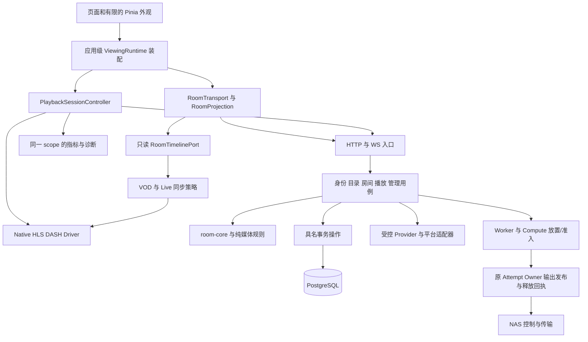

# RainSync 完整重构实施方案

日期：2026-10-09。唯一实施基线：`origin/codex/playback-report-fixes-20261008` / `2dc3ffb08a813b754331047d49fedef319508583`。
实施参考根目录：`C:/Users/ysyhly/.codex/worktrees/full-review-20261009/rainsync`。下文相对路径均以此目录为根；建议的新增路径明确标为目标。

依据：[本轮代码审查与验证结果](../reviews/FULL_CODE_REVIEW_20261009.md)。原 `C:/rainsync/docs/design/REFACTOR_PLAN_20261008.md` 保留为历史方案；本版补充当前实测问题、所有领域的工作包、验收前置与退出条件。

本文件是实施设计，没有把尚未发生的重构写成完成状态。阶段从 P00 开始；本轮只产生审查报告、方案和隔离验证证据。

## 1. 总体决策

采用现有进程角色内的模块化重构。保留现有九个 Rust member、Vue/Pinia、PostgreSQL、HTTP/WS 协议和服务部署方式。第一轮不新增微服务、不替换播放器技术栈、不重写数据库、不引入 CRDT 控制播放。

目标是让一种变化集中落在负责它的模块：播放路线在 selection/strategy/driver；授权在具名事务；资源释放在原 owner；房间投影在 projection；Provider 差异在适配器。既有功能覆盖普通点播、平台原生点播/直播、有限/静态 HLS、DASH、S3、advanced/ladder、NAS、集群、分布式计算、P2P 和声明式插件。

重构收益用以下变化衡量，而非行数：新用例不再接收整个 App/store；一个状态只有一个写入所有者；关键写入只有一个外层事务；错误可以区分提交结果与回收结果；按行为运行回归，无需依赖函数在文件中的位置。

## 2. 不可丢失的行为合同

| 合同 | 重构时必须保持 |
| --- | --- |
| 登录授权 | exact session、账号活动状态、CSRF、自然到期；前置 auth 不能代替等待后的事务复查 |
| 私有媒体库 | browse/play/share/manage 独立；library/source/grant 版本及到期仍在提交/读取时成立 |
| 房间写入 | Actor 串行；事务读取最新 snapshot 后 reduce；snapshot/result/event 原子提交；冲突返回最新状态 |
| 幂等 | 原 request key、规范化 payload、原 SID/operation；提交未知时查询原操作，不能换 key 创建第二份资源 |
| 播放代次 | 身份、room、connection、media、viewer plan、SDK/source/apply 代次含义不同，不能合为单一 version |
| 准备预算 | 使用原 reservation 的绝对 prepare_until；RPC、driver 切换和重试不重新开始计时 |
| 集群写入 | 路由不是授权；最后提交仍通过原节点 lease/fence，实例 incarnation 不能仅用 node ID 代替 |
| Worker 发布 | owner+attempt+有效 lease、隔离输出目录、验证后发布；旧 attempt 不得覆盖新输出 |
| 资源释放 | timeout/cancel/租约过期/容器退出不等于 disposed；进程、socket、文件读取、数据库回执分别证明 |
| 静态 HLS | parent prepare、capture、publication、child output、read lease 与 disposal 各有版本和责任；保持现有开关默认关闭 |
| Web 播放器 | 首次挂载后全局 PlaybackHost 常驻；mini/full/普通路由切换保持同一个 video 对象 |
| 同步 | 相同 revision 仍更新权限/owner/lifecycle，不重复 seek/load；gap/clock epoch 变化保留 RESUME |
| VOD/live | VOD 使用权威时间轴；live 绑定 broadcast identity 与 edge；finite duration 不能推导直播 seek 范围 |
| 观测 | SDK ready、可用媒体数据和呈现首帧分别计量；观测失败不改变授权/回退资格，也不阻止清理 |
| 提交返回值 | 已提交写入与提交后刷新/回收失败分开；不诱导用户重复已经成功的命令 |
| 凭据/网络 | 源访问、重定向、DNS/CIDR、方法及凭据 origin 约束保持；日志和 UI 不展示签名 URL/Cookie/token |
| 兼容 | wire 字段、schema 版本、迁移字节、任务 kind、recipe/reader marker 保持；新版本另建显式迁移 |

各工作包描述中引用这些合同，不用重新设计一套同名状态机。资源状态与逻辑业务状态可以相关，但不能互相冒充证明。

## 3. 目标模块及依赖方向



约束：HTTP handler 处理协议/身份，usecase 编排业务，规则层不访问 DB/网络，事务层保留完整业务原子性，适配器不读取房间角色数据库。media-core 先在 crate 内分组纯契约与平台执行能力，待依赖边界稳定且出现真实复用需求后再考虑拆 crate。

目标目录是迁移终态示意，不要求一次创建所有目录：

```text
apps/server/src/
  bootstrap/                 # 目标：配置、路由装配、启动与停机
  identity/                  # 目标：请求身份与局部事务授权接口
  catalog/                   # 目标：source/library/title/scan 用例
  room_application/          # 目标：Actor 边界、投影、生命周期用例
  playback/                  # 目标：facts/selection/prepare/publication
  platform_*/                # 复用现有平台专用入口
crates/persistence/src/
  room_commands.rs           # 目标：现有 commit_inner 整体提取
  playback_publication.rs     # 后续目标：可下沉的持久部分
  ...现有业务 ledger 与事务模块
apps/media-worker/src/
  scheduler.rs               # 目标：claim/限额/dispatch
  attempts/                  # 目标：按任务类型执行与 settlement
  ...现有 process/output_publish/owned_http/static_hls 模块
apps/web/src/
  app/viewing-runtime.ts      # 目标：房间与播放器装配
  features/rooms/{transport,projection,commands}/
  features/playback/{session,drivers,synchronization}/
  ...现有 candidate/maintenance/metric/deadline/live 模块
```

入口先委托新模块，调用方分批迁移；过渡接口有删除条件。禁止“创建巨大 Service 再把所有旧参数塞进去”，也禁止为每张表加通用 repository。

## 4. 各领域的完整重构设计

### 4.1 应用装配、配置、错误与身份

当前落点：`apps/server/src/main.rs` 的 App、启动/路由；`account_security.rs`、`admin_settings.rs`、`media_authorization.rs`、`database_checks.rs`；`crates/http-api/src/lib.rs`、`crates/protocol/src/errors.rs`。

将启动配置解析、外部客户端/owner 注册表创建、路由装配、后台任务启停从 main 分开。App 暂作为 composition root；新 usecase 接收窄 context（DB、所需 cipher/clock/owner），不用全局 service locator。部署环境值在启动时解析为类型；数据库可变设置仍通过原 revision/CAS 读取，不能误冻为启动快照。

请求身份与持锁授权区分：RequestIdentity 表示输入身份，LockedAdmission 表示某一事务中已完成的具体锁/检查。后者不能缓存、不能脱离事务复用，更不能表示永久权限。先抽 caller-first 管理事务的重复步骤，再抽 room-first 的局部步骤，不强行统一两种锁序。

ErrorCode 继续是公开错误真源；在内部关键用例逐步采用类型化失败类别，集中转换为已有 HTTP/WS 错误。保留中文固定安全文案和 Retry-After/Content-Range 等协议头；禁止把 anyhow 文本、上游响应或私密 URL直接回传。提交前失败、提交未知、已提交后清理待完成分别处理。

### 4.2 后端播放事实、选择、准备与发布

当前落点：`media.rs:574` 的 prepare_playback、`playback_requests.rs`、`playback_plan.rs`、`playback_capabilities.rs`，以及既有 `http_file_fallback.rs`、`finite_hls.rs`、`advanced_playback.rs`、`s3_playback.rs`、`platform_media/*`、`static_hls_*`。

1. **Facts**：取得版本化的媒体/来源事实、设备能力及本次请求输入。Facts 不包含“此前授权成功所以以后有效”的结论。
2. **Selection**：根据 Facts+Intent 生成内部 PreparedRoute/RouteDecision；先搬纯选择和验证，不做网络/SQL，不自行申请 grant。
3. **Prepare**：按路线调用现有模块，持有原 request、owner、绝对期限和资源责任。普通、native platform、live、compute 保留专用准入。
4. **Publication**：先把 `media.rs:1645` 附近到提交的完整事务整体提取到 Server，保留顺序与 crypto/provider guard 依赖；禁止第一步拆成多个单独 commit 的 repository 调用。

拟议内部数据结构（名称可按代码风格调整）：`PlaybackFacts`、`PlaybackIntent`、`PreparedPlayback`、`PublicationInput`、`PublicationReceipt`。对互斥路线使用 enum，已有 wire DTO保持不变；准备结果需要描述原 owner/资源和绑定条件，不只是一段任意 JSON。

发布事务继续检查 room lifecycle、snapshot/media generation、精确 login/membership、viewer plan、source/account policy、HTTP pin/capture/期限、当前 provider 与节点 fence；同一事务写 session、queue/job、metrics grant、request completion、上游 activation。helper 接收同一事务，不自行 begin/commit。

等 Server publication 输入收窄后，再将纯持久逻辑下沉 persistence。加密/外部事实留在应用层，避免 persistence 反向依赖 App。

### 4.3 房间 Actor、命令、生命周期与协作功能

当前落点：`apps/server/src/rooms.rs`、`room_lifecycle.rs`、`room_cleanup.rs`、`room_permissions.rs`、`presence.rs`、`timeline_chat.rs`；`crates/persistence/src/lib.rs:272` 的 commit_inner；`crates/room-core`。

Actor 保留串行队列、投递和广播；`persistence::room_commands` 拥有最新状态读取、权限、幂等重放、reduce、snapshot/result/event 写入和 final fence。旧 commit/commit_fenced 先委托新操作，保留调用兼容。END_MEDIA 的队列选择必须在事务中读取最新队列，不能移到 Actor 缓存决定。

生命周期拆为请求关闭、逻辑撤销、资源协调、最终 closed；room_cleanup 只根据真实 receipt 推进，不因为超时删除账本。转让、委派控制、踢人、邀请、游客进入和账号退出各是具名用例，复用局部授权而不抹平不同条件。

聊天、弹幕、reaction、在线成员、队列作为独立投影/命令接口，保留去重、游标所属房间、速率/容量限制和账号迟到隔离。消息历史读取失败不能诱导重复发送已提交内容。首轮不引入新的事件总线或把所有表改成 event sourcing。

### 4.4 Web 房间与播放接口

当前落点：`room-runtime.ts`、`playback-runtime.ts`、`playback-runtime-types.ts`、`AppShell.vue`、`app/playback-host.ts`。

先改接口，再改工厂位置：PlaybackRuntimeContext 不再接受完整认证 store、可写 RoomState Ref、完整 Clock 和共享 error/run。改为有限身份快照/失效订阅、只读 RoomTimelinePort、明确 room command、播放自己的错误与 busy。应用级 createViewingRuntime 负责装配，原 Pinia 暂作兼容外观。

区分业务 `PlaybackIntent` 与 `PlaybackObservationScope`。两者关联同一个不可变 owner token；meter 不拥有重试资格，driver 不拥有会话授权。身份、房间、连接、媒体、plan、source/SDK/apply 的 generation 分别封装，不把它们压为一个 counter。

RoomProjection 接受 WS/HTTP snapshot、ack、lifecycle 与历史响应，原子更新相关字段，再产生有限 effects。相同 revision 更新权限/owner/control epoch/lifecycle；gap 和 clock epoch 变化产生原 RESUME，不重复 load/seek。Transport 管 socket、序号、重连和时钟采样；Projection 不直接操作 video。

### 4.5 Web 会话控制、Driver、同步和计量

从 `loadAttempt` 的 prepare/readiness 阶段开始提取 PlaybackSessionController，再逐个抽 Native/HLS/DASH driver。复用已有 `packages/player-core` adapter、候选发现、request manager、maintenance、期限和 live recovery；避免并行新旧 load 流程。

会话控制器拥有 intent、request key、SID、plan、续期、取消、候选与回退预算。每个异步回执必须校验原 scope；换片/离房/身份变化先同步使旧 callback 失效，再异步清理旧对象。清理闭包捕获旧 request/SID，迟到 DELETE 不能停止后继会话。注销不等待远端排空。

Driver 拥有 SDK、媒体 attachment、bound fetch 与清理，输出媒体事实：SDK ready、metadata/data ready、presented frame、seekable、rate readback 和分类错误。不在 driver 中申请 grant，不把网络/授权失败转换为 decoder fallback。

原 grant 内切换 source/driver 保留首帧绝对预算。VOD 与 Live synchronizer 分别消费时间轴，复用 sync-engine；纠偏动作通过 driver port 执行，速率设置成功以浏览器读回为准。Native→MSE、DASH/SIDX、HLS ladder、static child、P2P loader 分批迁移。

观测在现有 metric-runtime 上拆业务 intent 与 measurement scope，保留 prepare/SDK/data/frame 分段、v1/v2 grant、无 grant 本地诊断和迟到帧只能清除自己超时的规则。DASH 预热只由明确 VOD 意图和能力触发，不提前授权或获取签名媒体。

### 4.6 页面、组件、API DTO 与 UI 异步状态

账号/管理/库/房间页面继续按 feature 分组；不批量改视觉。页面级组件负责路由，嵌入交互用独立组件，首先解除 InvitationPage 对 LoginPage 整页的静态复用。

公共异步行为只抽稳定部分：提交中的 busy、身份代次、可取消读、成功提交与刷新失败的区分。不要用一个通用 useAction 替代房间、会话和账号各自的业务失效规则。操作提交后只确认提交时的 draft，保留用户更新中的新编辑。

`shared/api/client.ts` 保留同源、no-store、CSRF 和 StaleIdentity。关键外部响应从 unknown 经边界解析成 DTO；优先管理设置、平台响应和 playback plan，不在业务深处到处 `as T`。逐步将 shared/api/types 中与 Rust 重复的稳定协议纳入生成，但不为少量内部 ViewModel 强行建立跨语言模型。

### 4.7 Worker 调度、执行与媒体核心

当前落点：`apps/media-worker/src/main.rs:715` jobs、`process.rs`、`output_publish.rs`、`cache.rs`、`owned_http.rs`、`previews.rs`、`static_hls_operation/*`；`crates/media-core`。

先提取 scheduler：claim、并发/预算准入、stop-claim 竞态和任务 kind 分派；随后按已有路径提取 executor。AttemptContext 绑定原 claim 的 owner/attempt、lease、输出目录、输入句柄和预算，不能靠重新创建对象重置期限。

输出发布和 settlement 是单独接口：验证 metadata/manifest/内容及 owner/fence 后发布；encoder、decoder、blocking I/O、读者 drain 后才写 durable ACK、释放预算。失租禁止发布，不意味着可以忘记尚未释放的进程/句柄。硬件失败的重试要按现有新 attempt 规则，不能在旧输出目录静默覆盖为软件编码。

media-core 内划分 `contracts/policy`、`owned_io/process`、`media inspection/timeline` 三类职责，保留现有底层实现。文件 path 检查不替代已打开 handle 的所有权/版本校验；纯结构验证通过也不授予捕获/写入权限。平台专属行为显式标注，不把 Linux fail-closed 门控变成 Windows 伪实现。

preview 与播放共享输入/进程的有限底层能力，但任务优先级、配额、revision、lease recovery 和过期 cache 不共用一个业务状态机。

### 4.8 NAS 与 Compute Node

将 NAS main 分成控制连接/重连、扫描与索引提交、transfer admission、数据传输、receipt journal 五个接缝，复用现有 drain/receipt_mode/uplink reporter。

保留控制与数据发送分离、有限 slots、拒绝队列和真实背压 heartbeat。发送中的 future 不因重试重新创建，避免部分发送重复；失去授权先取消旧 transfer，实际 join/句柄释放后再记录回执。文件新版本必须重新绑定，不能把旧 stat 当作当前输入证明。

Compute Node 保留独立准入、连接 incarnation、recipe、预算与输出验证，普通 Agent token 不能得到计算权限。Server compute 将 policy/admission、placement、output verification、retention 分开，和普通 Worker 共用的只能是稳定底层能力。

### 4.9 Provider、平台账户和受控网络

Provider façade 的字符串 kind 在边界解析成内部 SourceKind；配置仍兼容旧 wire。依实际调用引入 browse/probe/negotiate/read 小能力，不造一个要求所有 Provider 都实现无意义方法的巨型 trait。

Jellyfin/Emby、S3、通用 HTTP 和 native platform 保留各自的签名/源身份/账户策略。guarded scan 每页重新取得当前 source fence，不能只在扫描开始验证一次。签名材料缓存与授权、媒体 URL 缓存严格分开；Bilibili signing key 继续按账号/登录/revision 隔离、有界和过期，每次 prepare 重建当前凭据客户端。

平台登录/OAuth/二维码轮询/账户 revision 与平台媒体解析是不同用例。取消与账号切换令旧回执失效；退出后的 owner 回收不再依赖新一次登录授权。按已验证 origin/CIDR/redirect 策略发请求，禁止搬迁时退回宽松全局 reqwest 客户端。

### 4.10 媒体库、片源、目录、扫描与预览

当前落点：`media.rs` 的 source/library 入口、`source_settings.rs`、`source_access.rs`、`private_library*.rs`、`media_browse.rs`、`media_titles.rs`、`media_previews.rs`；前端 admin/library/private-library。

分为 source mutation、library authority、browse projection、scan orchestration、preview lifecycle。首先修 F1，建立 CommittedSourceChange 的返回语义和独立 cleanup 状态；然后移动具名用例。

保留设置 revision 与 access_policy_revision 的不同含义、未提交 credential 字段保持原值、语义 no-op 不重加密、不错误失效缓存。源更换、共享撤销和删除保留 media identity、队列/标题/历史关系；按现有 SQL 与生命周期约束处理，不级联物理删除代替退役。

目录查询继续服务端分页/权限过滤；缩略图按可见范围申请，不恢复 N+1 全量拉取。标题来自显式 provider episode 元数据，不能按页面序号猜集数。性能优化前收集实际 SQL 执行计划、行数与等待，再决定索引或分页结构，不用理论猜测批量加索引。

### 4.11 persistence、迁移与协议生成

以具名事务组织持久层，不按表拆 DAO。SQL 允许就近位于其事务模块；应用层仍有编排 SQL不是天然缺陷，关键是提交边界明确。自然到期检查使用实际时钟，锁本身不能停止时间。

为涉及 room/user/library/source/request/attempt 的事务建立锁序表及阻塞测试；不同用例可有不同合法局部顺序，先验证再统一。事务之外的 provider/FFmpeg/scan/drain 不移入持锁区。将固定字符串 SQL 测试迁移为调用具名生产操作并检查 DB 行/锁/返回结果。

87 个历史迁移保持字节不变，纯搬模块不新增迁移。确需 schema 调整另立 ADR 与 expand/contract 方案，覆盖旧数据、reader/recipe 版本、quiet window、NOWAIT、恢复与不可逆边界。启动迁移和多个节点并发启动的实际行为通过隔离 PostgreSQL 验证。

Rust protocol 是已有生成真源，继续运行 export --check。先为新用例边界收窄 JSON Value 和内部 ID 类型，逐步补齐未生成的稳定 HTTP DTO；不要同时更换全部协议、SQL JSON 结构和前端 ViewModel。

### 4.12 集群、P2P、插件与可观测性

集群拆 route/peer transport/lease authority，只在 Server 用例中应用写 fence；remote route cache 不成为写入授权。保留两节点切换、旧实例消息、命令幂等及 guest rate identity 的回归。

P2P 信令仅适用于已同意的同房间/同 immutable output，继续满足登录、generation、有效 output 和 TTL/budget 限制；不能借重构变成任意来源代理。计算和 P2P 保持关闭或原有显式开关，不新增自动启用逻辑。

插件仍是封闭声明式 metadata 扩展。当前 digest 含 `plugins.rs` 源码，抽文件前先确定稳定 artifact identity 与旧配置/回退 snapshot 的兼容映射，覆盖行尾差异；不得仅改 hash 算法而让安装记录全部失效。动态脚本/WASM/远程插件不在本次范围。

观测集中公共字段与错误分类，但 request/plan/attempt/owner ID 不滥作高基数指标标签。保留低基数 Prometheus 指标，细节进受控日志/trace；明确“业务取消、真实 I/O 已退出、ACK 待持久化”三个状态。新增 owner 阻塞年龄/重试次数的安全观测，避免裸重试循环成为不可诊断的关闭阻塞。

### 4.13 测试、CI、部署与运维脚本

分层门槛：纯规则→类型/编译→实际 HTTP/DB→真实浏览器→Linux 进程/文件/socket→平台/设备/升级恢复。各层记录前置、操作、期望、源码/二进制绑定、产物和清理；mock 不能替代真实资源释放。

把串接的 npm 命令清单按领域拆成可独立运行的工作流入口，共享既有 owned fixture；避免所有阶段串在单一 job 中，前一个失败使后面的核心合同长期不运行。按依赖矩阵并行独立 CI jobs，单个数据库/owner 只有一个协调者。继续保留完整关键测试门槛，不能用 changed-files 过滤静默跳过跨域授权测试。

修复缓存/manifest 假设；声明 Windows symlink、Unix fcntl、Linux fd/namespace、FFmpeg 的环境前置。缺少必要环境时不能宣称测试通过；独立环境 gate 可报告不适用，Linux 必跑门槛仍保留。

部署保持 release digest、source/binary/image 绑定、最小 contract probe、备份及恢复脚本。本次没有执行部署。native HTTP owner ledger 的版本切换要求排空旧 Server 的原生读取，新旧版本共库滚动兼容尚未证明；没有 execution 行不能推断旧读者消失。不要用改 closed/删 cleanup 记录完成切换。

## 5. 可执行工作包与依赖

每行是一组可独立审查的变更；过大时按路线拆成多个 PR，禁止把整表作为一个大 PR。P00—P02 优先于结构移动。

| 编号 | 内容与主要落点 | 依赖 | 完成条件 |
| --- | --- | --- | --- |
| P00 | 冻结候选、能力/锁序/owner/环境清单；建立验证结果登记 | 无 | 源码/锁文件/二进制一致，失败与未验证分开；原工作区保留 |
| P01 | 修复 F2/F3：Vite 转换的指标 fixture、产物图检查、嵌入 LoginPanel | P00 | 隔离目录下两项指标通过，bundle 3 项通过，初始预算和懒加载保持 |
| P02 | 修复 F1；接入 native owner/cleanup gate | P00 | 两类提交后清理失败仍正确确认保存；ACK/关闭夹具必跑且正向回收 |
| P03 | bootstrap、窄 application context、局部身份 helper、内部错误转换 | P02 | 新用例不传完整 App；原 lock order/最终到期检查/错误码保持 |
| P04 | PlaybackRuntimeContext 收窄为 ports；ViewingRuntime 装配 | P01 | 播放不依赖完整 session store/可写 room state；页面外观兼容 |
| P05 | 拆 PlaybackIntent/ObservationScope；明确各代次 owner token | P04 | 迟到身份/房间/SDK/请求不污染后继，首帧预算不重置 |
| P06 | RoomProjection/Transport/Commands；收缩 ...playback | P04、P05 | 同 revision、gap、clock、重连、迟到历史/队列保持；页面逐个迁移 |
| P07 | playback facts/selection，内部路线 enum | P00、P03 | 同样事实得到同样路线/错误/轨道/回退；无外部副作用 |
| P08 | Server publication 整体提取、类型化输入/回执 | P02、P03、P07 | 单事务、完整 guard、session/request/job/activation 同提交 |
| P09 | prepare orchestrator 与各路线策略；保留专用入口 | P08 | 原 deadline/key/owner、丢回复查原操作、取消与 drain 保持 |
| P10 | persistence::room_commands；Actor 窄接口 | P03 | 最新 snapshot reduce、END_MEDIA、重放、权限/节点复查原子通过 |
| P11 | Web PlaybackSessionController：prepare/readiness/SID/续期/取消 | P05、P09 接口稳定 | 原请求重放与专用 origin retry；旧 DELETE 不影响后继 |
| P12 | Native/HLS Driver 分别提取；有限/media errors | P11 | 唯一 video、autoplay、seekable、source 切换与回退资格保持 |
| P13 | DASH Driver、SIDX、预热与平台 text 接口 | P11 | 实际 Range/首帧/连续 seek/迟到 MPD，以及无 grant 指标通过 |
| P14 | VOD/Live Synchronizer、播放页面窄 façade | P06、P12、P13 | 断连/隐藏/时钟重校准/rate readback/live identity 保持 |
| P15 | Worker scheduler 与类型化 dispatch | P09 | stop-claim、限额、公平性、无重复 owner；任务 spec 严格解码 |
| P16 | Worker executor/publication/settlement；media-core 内部分组 | P15 | 失租/崩溃/磁盘满/DB 失败不误发布或提前释放；Linux 所有权验证 |
| P17 | SourceKind 与 Provider 小能力；平台账户/缓存边界 | P03、P07 | redirect/凭据隔离/分页 fence/缓存 revision/账户迟到保持 |
| P18 | catalog/source/library/title/scan/preview 用例 | P02、P03、P17 | 权限等待/到期、no-op 设置、目录分页、preview lease、删除后回收保持 |
| P19 | NAS connection/transfer/receipt；Compute admission/placement/retention | P16、P18 | 背压持续、控制响应、真实句柄关闭、attempt budget 与计算专用授权 |
| P20 | 稳定 DTO 生成、内部 Value 收窄、SQL 合同测试迁移 | 每个对应领域稳定 | export --check、错误映射和 wire 兼容；测试不依赖搬迁路径 |
| P21 | 插件稳定身份/兼容回退；P2P 与集群用例接口 | P03、P10、P19 | 旧安装配置/rollback 可用；peer/节点/输出代次保持 |
| P22 | 配置快照、公共观测字段、owner 阻塞诊断 | P03、P16、P19 | 无凭据泄露/高基数爆炸；业务取消、I/O 释放、ACK 分别可见 |
| P23 | CI 分层入口、当前源码绑定、部署/升级/恢复合同 | P01、P02；持续跟随各阶段 | Linux/浏览器/PG 各自证据，固定镜像，超时与清理，恢复演练 |
| P24 | 删除过渡接口、依赖约束、最终能力矩阵验收 | P06—P23 | 所有调用迁移，单状态所有者，回退可执行，未覆盖能力明确 |

顺序建议：第一批 P00、P01、P02；第二批 P04/P05 与 P03/P07；随后 P08/P10；然后 P09/P11—P14；最后 Worker/NAS/Provider/目录及集群插件收尾。共享授权/原子发布/owner 接口一次只由一个变更修改。表中的并行是未来实施排程，本轮未启动其他 agent。

估算仅用于分配精力：基础修复与基线约 3—6 工程日；Server/前端核心边界约 15—25；执行/Provider/目录/分布式约 15—25；合同测试迁移与最终验收约 8—15。合计约 41—71 工程日，不是日历承诺；Linux、真实源、设备和升级环境准备另计。完成前两批后按实际回归成本重新估算。一个全职开发者按 8—14 个工作周规划更稳妥，不要求先停更两个月做大爆炸改写。

## 6. 第一批 PR 的具体交付

### PR A：恢复可信前端门槛（P01）

- 新增由 Vite 处理的 native-metrics browser entry，替换硬编码 optimizeDeps URL；保留实际 runtime/SDK/fetch/帧回调。
- 提取可嵌入登录面板；调整 bundle 测试为合法动态入口/共享块识别，并增加邀请页覆盖。
- 验收：使用外部 RAINSYNC_ARTIFACT_DIR 的 npm lint/test/build、bundle gate、两项 native-metrics，以及邀请/登录的既有浏览器回归。
- 回退：单提交可撤销；不改 API/DB。不能通过删除测试或提高预算完成。

### PR B：确认写入与回收分离（P02 的写入部分）

- 把 F1 的生产入口返回值固定在原事务结果；提交后 retirement 失败记录为独立状态，由既有 maintenance 收敛。
- 同步覆盖 access-policy 与 source settings，保持 source revision 即刻 fencing；不等待真实 drain 才告知保存。
- 将本轮外部复现移为仓库中的正式 owned fixture，增加“先前失败重试读取当前 revision”的客户端合同。
- 验收：正常、CAS 冲突、授权撤销/自然到期、提交前 DB 错误、提交后 retirement 错误；不得把提交未知当成功。

### PR C：资源门槛进入 CI（P02 的验收部分）

- 构建 ignored owner fixture 的测试二进制；显式运行 native-delivery-owner、room-cleanup-native；静态 HLS gate 明确 Linux 前置。
- 保存安全摘要、源码/二进制/image 摘要及清理结果。测试数据库/HTTP/进程由各自 owner 管理。
- 验收：正常关闭、body drop、HEAD/Range 未返回、背压、ACK 失败与 0 行、恢复原 owner、停止后拒绝新 admission。

### PR D：窄播放上下文（P04）

- 修改 playback-runtime-types、room-runtime、playback-runtime，替换完整 store/可写 state/共享 run-error。
- app/viewing-runtime 只是装配；旧 Pinia 外观保持兼容，首次提取不同时改 driver。
- 验收：身份切换、换房、同 revision 权限变化、唯一 video、计量失败不影响清理。

### PR E：播放发布单元（P08）

- publication 事务先整体提取到 Server，以现有 helpers 和锁序完成；facts/selection 只提供输入。
- 记录每一种发布路径的最终 guard、表写集合、期限/owner 与返回结果。
- 验收：等待期间撤权/到期、旧 media/plan、重复 key、发布提交未知、数据库失败与资源回收各自处理。

## 7. 验收命令、环境与矩阵

以下是实施阶段的命令，不代表本轮均已执行通过。具体已运行结果以审查报告为准。每批使用新的绝对产物目录，避免旧二进制、报告或 dev server污染。

```powershell
Set-Location 'C:\Users\ysyhly\.codex\worktrees\full-review-20261009\rainsync'
$env:RAINSYNC_ARTIFACT_DIR='C:\rainsync-review-runtime\refactor-batch-01\artifacts'
$env:RAINSYNC_RUNTIME_ROOT='C:\rainsync-review-runtime\refactor-batch-01\runtime'
$env:CARGO_TARGET_DIR='C:\rainsync-review-runtime\refactor-batch-01\cargo-target'
npm ci
npm run lint
npm test
npm run build
npm run test:frontend-bundle
cargo fmt --all --check
cargo check --workspace --all-targets --locked
cargo test --workspace --locked --no-fail-fast
cargo run -p protocol --example export -- --check
npm run test:backend-contracts
```

在 Linux CI 执行 `cargo clippy --workspace --all-targets --locked -- -D warnings`、workspace tests 与真实原生夹具。Windows 特有警告/门控应单独归档，不能从 Windows cargo check 推出 Linux owner 通过。

HTTP/DB 测试先用现有 `scripts/bind-native-backend.mjs` 构建当前 bins/examples，校验构建前后源码未变；将输出 binding 路径设为 `W03_BACKEND_BINDING`。Docker/native PostgreSQL按 owned fixture要求就绪，真实媒体测试另配置 FFmpeg/FFprobe。禁止给夹具传正式 DATABASE_URL。

```powershell
node scripts/bind-native-backend.mjs
# 将上一步实际返回的路径设置为 W03_BACKEND_BINDING 后再运行要求绑定的脚本。
npm run test:review-regressions
cargo test -p rainsync-server --no-run --locked
node tests/native-delivery-owner.mjs
node tests/room-cleanup-native.mjs
node tests/server-preparation-drain.mjs
node tests/worker-delivery-shutdown.mjs
node tests/agent-drain-receipts.mjs
```

Linux 静态 HLS owner 入口要求脚本指定的固定镜像、离线依赖/配置、image ID 和 PostgreSQL 版本等前置；先核验当前脚本，不复制旧任务的环境值。真实平台/CDN用独立授权测试账号及媒体样本，执行前单独定义范围；不自动消耗正式账号额度。

浏览器接缝首先运行以下实际 SDK/播放器用例（P01 修复后应全绿），再按涉及页面扩大：

```powershell
npx playwright test tests/browser/playback-host-lazy.spec.ts tests/browser/dash-segment-base.spec.ts tests/browser/native-platform-metrics.spec.ts --project=desktop
```

| 变更领域 | 至少覆盖的行为 | 现有入口示例 |
| --- | --- | --- |
| 身份/源/私库 | 撤权与锁等待、自然到期、提交后返回值、CAS/no-op | source-mutation-authority、login-admission-regressions、private-library settings/expiry |
| 房间/集群 | 幂等、冲突、END_MEDIA、节点过期、同 revision 权限 | room-authority-consistency、queued-control-authority、control-cluster-runtime、queue-propagation |
| 播放准备 | 原期限、原 key/SID、丢回包、重复/取消、来源更新 | playback-generations、http-playback-continuation、static-hls-public-prepare |
| Web 会话 | 迟到异步隔离、原 grant 预算、续期、唯一 video | room-runtime、room-clock-recovery、player-recovery、persistent-playback-host |
| Native/DASH/HLS | 实际 Range、SIDX 音视频时间线、seek、首帧、SDK 清理 | dash-segment-base、native-platform-metrics、playback-host-lazy |
| owner/输出 | child 与读取真实退出、ACK 失败/0 行、旧 attempt 拒绝 | native-delivery-owner、static-hls-owner-linux、cache-writer-safety、worker-delivery-shutdown |
| NAS/compute/P2P | 控制不饥饿、背压、失联、句柄关闭、独立权限和预算 | agent-drain-receipts、nas-uplink-metrics、distributed-compute-admission/retention/hd |
| Provider/目录 | origin/redirect、缓存账户隔离、scan fence、分页/preview | source-access-gateway、upstream-profile-admission、source-settings、media-hierarchy-native |
| 协议/迁移/运维 | 生成一致、旧数据升级、最小 reader、镜像与恢复绑定 | export --check、各 migration fixtures、runtime-images、postgres-recovery |

每个工作包必须列真实能力，不用“全测试通过”掩盖 skipped/ignored。没有环境的路径保持待验收，不把测试删掉或改为永远返回成功。

## 8. 迁移纪律与回退

一次只改一个主要接缝；默认兼容公开 DTO、数据库、开关与路由。旧入口先委托新实现，严禁影子双运行产生双 request、双 grant 或双 owner。新旧模块共享同一个状态所有者，调用迁移完成后删除委托入口。

锁序、错误语义、协议变化分别单独提交；不能用“纯重构”名义夹带权限、队列策略、预算或播放器 fallback 变化。确需行为变化另写触发条件与 before/after。

每个 PR 的回退单元是独立提交。未改数据格式时 revert 到同一原子合同；有 schema/reader 变化时采用明确的兼容窗口和升级/恢复脚本。未知 owner责任仍留在原 ledger，回退不得强制标记 disposed/closed。

旧 `C:/rainsync` 单独保留；如需迁入旧未提交 HLS 工作，另建能力迁移清单，按内容摘要和行为合同对照新版，不能以相同迁移号或相同文件名判定兼容，也不能重放整份旧补丁。

## 9. 总体完成标准

1. 三项本轮确认问题有当前源码绑定的回归，native owner/cleanup 纳入必跑验收。
2. 新用例/页面只依赖有限 ports；App/store 不再穿透新边界，过渡入口有实际删除记录。
3. 播放发布与房间命令各有单一事务所有者，原授权、锁序、到期、幂等和节点 fence通过行为验收。
4. Worker/NAS/Server 原 owner持续负责真实释放与 durable receipt；没有“取消即释放”的替代逻辑。
5. 每一种现有播放路线、平台、库与协作能力在能力矩阵中有当前结果或明确未验证项；不能只验常用 MP4。
6. 新旧协议生成物一致，历史迁移不变，旧配置/插件身份与升级回退经过验证。
7. CI 结果能定位到当前 source/binary/image和 owned fixture，正确保存失败与清理证据。
8. 真实设备、平台、Linux 与恢复/长稳门槛按本次发布范围关闭；未通过时不宣布发布就绪。
